# MCP HTTP Transport Guide

A comprehensive guide to understanding the `http.ts` module - a custom HTTP server implementation for the Model Context Protocol (MCP).

## Table of Contents

1. [What is MCP?](#what-is-mcp)
2. [Why HTTP Transport?](#why-http-transport)
3. [Architecture Overview](#architecture-overview)
4. [Code Walkthrough](#code-walkthrough)
5. [How Sessions Work](#how-sessions-work)
6. [Request Flow](#request-flow)
7. [Usage Example](#usage-example)

---

## What is MCP?

**Model Context Protocol (MCP)** is a standardized protocol that allows AI assistants (like Claude) to communicate with external tools and services. Think of it as a universal language that lets AI talk to your code.

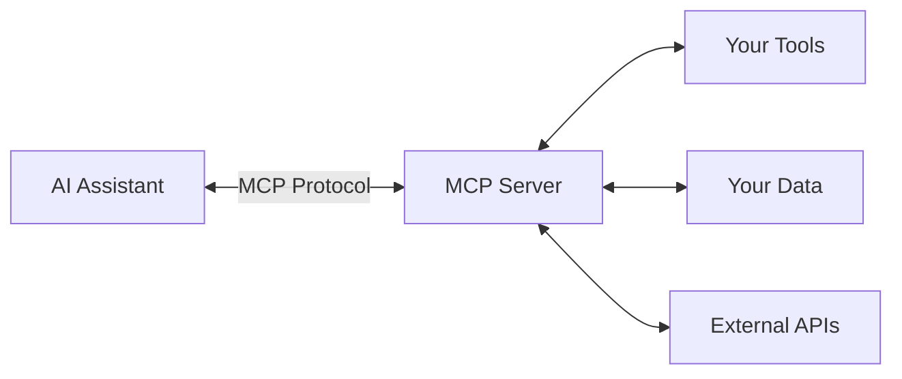

### Key Concepts

| Term | Description |
|------|-------------|
| **MCP Server** | Your application that exposes tools/resources to AI |
| **MCP Client** | The AI assistant that connects to your server |
| **Transport** | How messages travel between client and server |
| **Tools** | Functions the AI can call (e.g., "add numbers") |
| **Resources** | Data the AI can read (e.g., files, databases) |

---

## Why HTTP Transport?

MCP supports multiple transport methods. Here's how they compare:

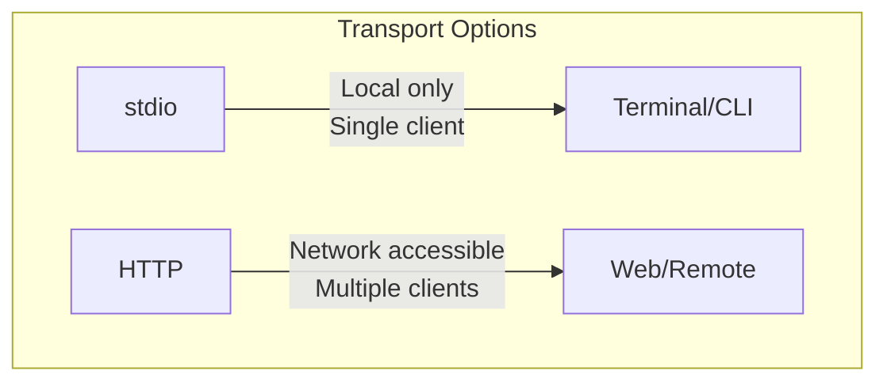

| Transport | Use Case | Pros | Cons |
|-----------|----------|------|------|
| **stdio** | Local CLI tools | Simple, no network | Single client only |
| **HTTP** | Web services, remote access | Multiple clients, network accessible | More complex setup |

**We use HTTP because:**
- Multiple AI clients can connect simultaneously
- Works over networks (not just locally)
- Can be deployed as a web service
- Supports session management

---

## Architecture Overview

The `http.ts` module creates an HTTP server that speaks the MCP protocol. Here's the big picture:

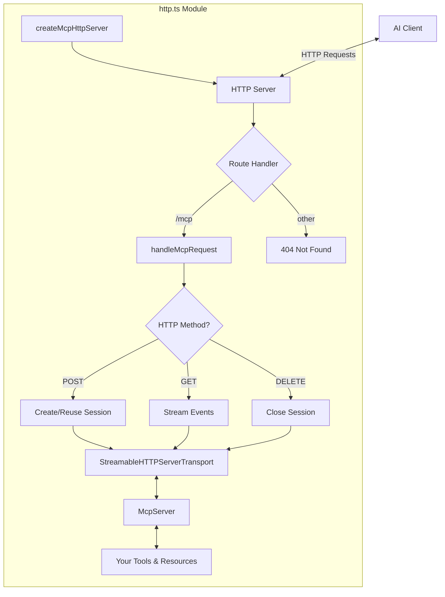

### Component Breakdown

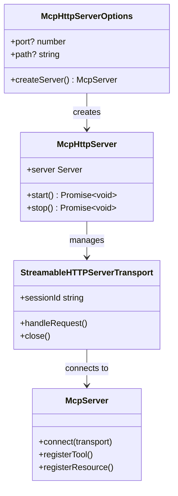

---

## Code Walkthrough

Let's break down every part of `http.ts`:

### 1. Imports

```typescript
import { createServer, IncomingMessage, ServerResponse, Server } from "http";
import { McpServer } from "@modelcontextprotocol/sdk/server/mcp.js";
import { StreamableHTTPServerTransport } from "@modelcontextprotocol/sdk/server/streamableHttp.js";
import { randomUUID } from "crypto";
```

| Import | Purpose |
|--------|---------|
| `createServer` | Node.js built-in to create HTTP servers |
| `IncomingMessage` | Type for incoming HTTP requests |
| `ServerResponse` | Type for HTTP responses |
| `Server` | Type for the HTTP server instance |
| `McpServer` | The MCP protocol handler from the SDK |
| `StreamableHTTPServerTransport` | Handles HTTP-based MCP communication |
| `randomUUID` | Generates unique session IDs |

### 2. Type Definitions

```typescript
export interface McpHttpServerOptions {
  /** Factory function that creates a new McpServer instance per session */
  createServer: () => McpServer;
  /** Port to listen on (default: 3000) */
  port?: number;
  /** Path for MCP endpoint (default: "/mcp") */
  path?: string;
}
```

This defines what you pass to `createMcpHttpServer()`:

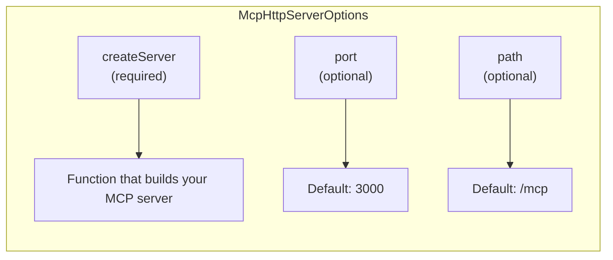

```typescript
export interface McpHttpServer {
  server: Server;
  start: () => Promise<void>;
  stop: () => Promise<void>;
}
```

This is what you get back - an object to control the server.

### 3. The Main Factory Function

```typescript
export function createMcpHttpServer(options: McpHttpServerOptions): McpHttpServer {
  const { createServer: createMcpServer, port = 3000, path = "/mcp" } = options;
  const transports = new Map<string, StreamableHTTPServerTransport>();
```

**What's happening:**
1. Destructure options with defaults (`port = 3000`, `path = "/mcp"`)
2. Create a `Map` to store active sessions (key = session ID, value = transport)

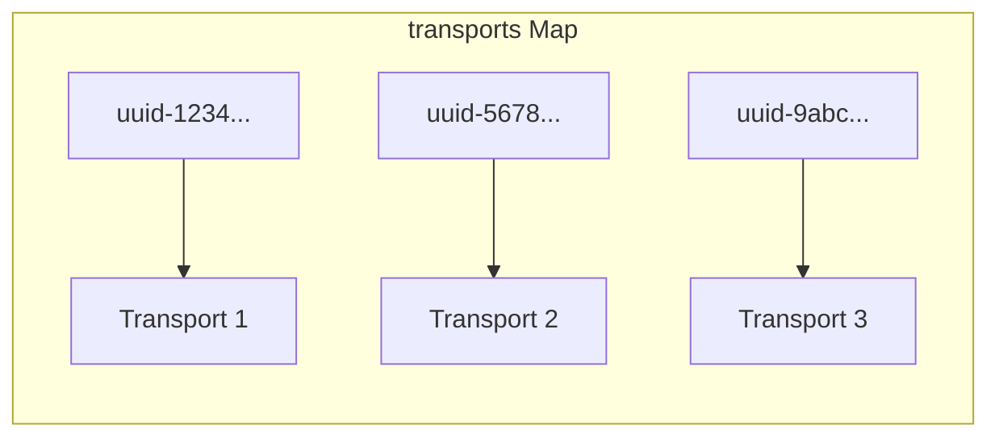

### 4. Helper: Parse Request Body

```typescript
async function parseBody(req: IncomingMessage): Promise<unknown> {
  return new Promise((resolve, reject) => {
    let body = "";
    req.on("data", (chunk) => (body += chunk));
    req.on("end", () => {
      try {
        resolve(body ? JSON.parse(body) : undefined);
      } catch (e) {
        reject(e);
      }
    });
    req.on("error", reject);
  });
}
```

**Why this exists:** HTTP requests arrive as streams of data chunks. This function:

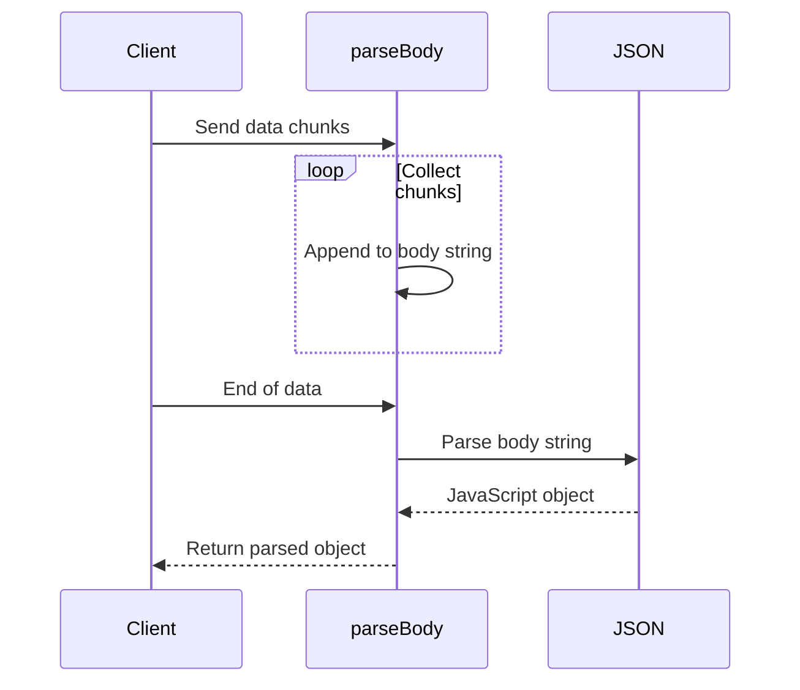

### 5. Helper: Send JSON Response

```typescript
function sendJson(res: ServerResponse, status: number, data: unknown) {
  res.writeHead(status, { "Content-Type": "application/json" });
  res.end(JSON.stringify(data));
}
```

A simple utility to send JSON responses with proper headers.

### 6. The Request Handler (Core Logic)

```typescript
async function handleMcpRequest(req: IncomingMessage, res: ServerResponse) {
  const sessionId = req.headers["mcp-session-id"] as string | undefined;
```

Every MCP request may include a session ID header. This identifies which conversation/session the request belongs to.

#### POST Requests (Main Communication)

```typescript
if (req.method === "POST") {
  let transport: StreamableHTTPServerTransport;

  if (sessionId && transports.has(sessionId)) {
    // Reuse existing session
    transport = transports.get(sessionId)!;
  } else {
    // Create new session
    const mcpServer = createMcpServer();
    transport = new StreamableHTTPServerTransport({
      sessionIdGenerator: () => randomUUID(),
      onsessioninitialized: (id) => {
        transports.set(id, transport);
        console.log(`Session initialized: ${id}`);
      },
    });

    transport.onclose = () => {
      if (transport.sessionId) {
        transports.delete(transport.sessionId);
        console.log(`Session closed: ${transport.sessionId}`);
      }
    };

    await mcpServer.connect(transport);
  }

  const body = await parseBody(req);
  await transport.handleRequest(req, res, body);
}
```

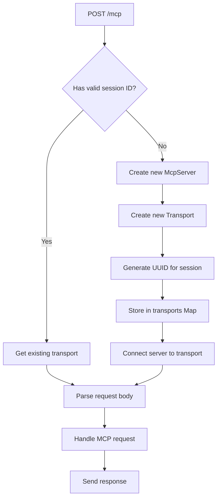

#### GET Requests (Server-Sent Events)

```typescript
} else if (req.method === "GET" || req.method === "DELETE") {
  if (!sessionId || !transports.has(sessionId)) {
    sendJson(res, 400, {
      jsonrpc: "2.0",
      error: { code: -32000, message: "Invalid or missing session ID" },
      id: null,
    });
    return;
  }

  const transport = transports.get(sessionId)!;
  await transport.handleRequest(req, res);
}
```

GET requests are used for Server-Sent Events (SSE) - a way for the server to push updates to clients. DELETE closes a session.

### 7. The HTTP Server

```typescript
const httpServer = createServer(async (req, res) => {
  const url = new URL(req.url || "/", `http://localhost:${port}`);

  if (url.pathname === path) {
    try {
      await handleMcpRequest(req, res);
    } catch (error) {
      console.error("Error handling request:", error);
      if (!res.headersSent) {
        sendJson(res, 500, {
          jsonrpc: "2.0",
          error: { code: -32603, message: "Internal server error" },
          id: null,
        });
      }
    }
  } else {
    sendJson(res, 404, { error: "Not found" });
  }
});
```

This is the actual HTTP server. It:
1. Parses the URL
2. Routes `/mcp` requests to `handleMcpRequest`
3. Returns 404 for other paths
4. Catches errors and returns proper JSON-RPC error responses

### 8. Return Object (Server Controls)

```typescript
return {
  server: httpServer,
  start: () =>
    new Promise((resolve) => {
      httpServer.listen(port, () => {
        console.log(`MCP server listening on http://localhost:${port}${path}`);
        resolve();
      });
    }),
  stop: async () => {
    console.log("Shutting down...");
    for (const transport of transports.values()) {
      await transport.close();
    }
    httpServer.close();
  },
};
```

Returns an object with:
- `server`: The raw HTTP server (for advanced use)
- `start()`: Begins listening for connections
- `stop()`: Gracefully shuts down (closes all sessions first)

---

## How Sessions Work

Sessions allow the server to maintain state across multiple requests from the same client.

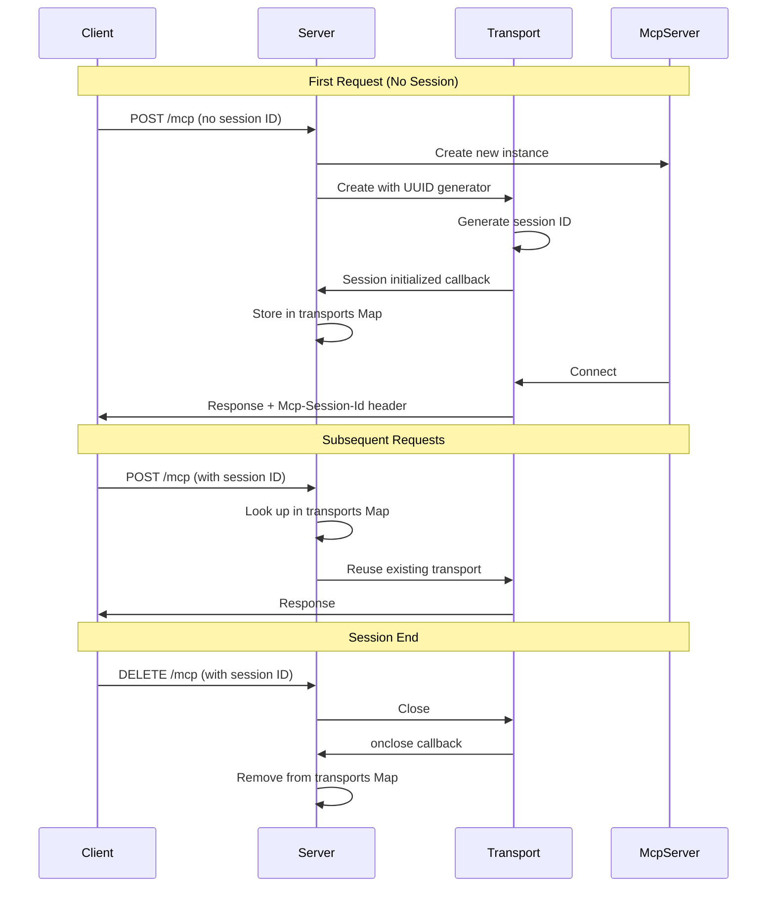

### Session Lifecycle

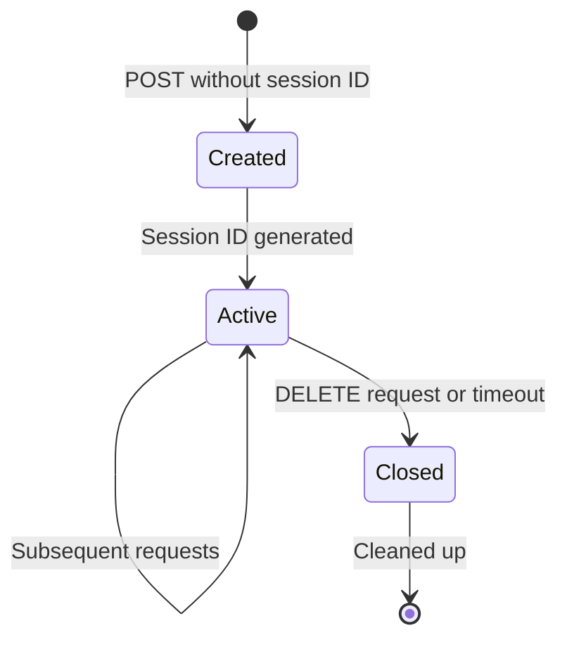

---

## Request Flow

Here's the complete journey of an MCP request:

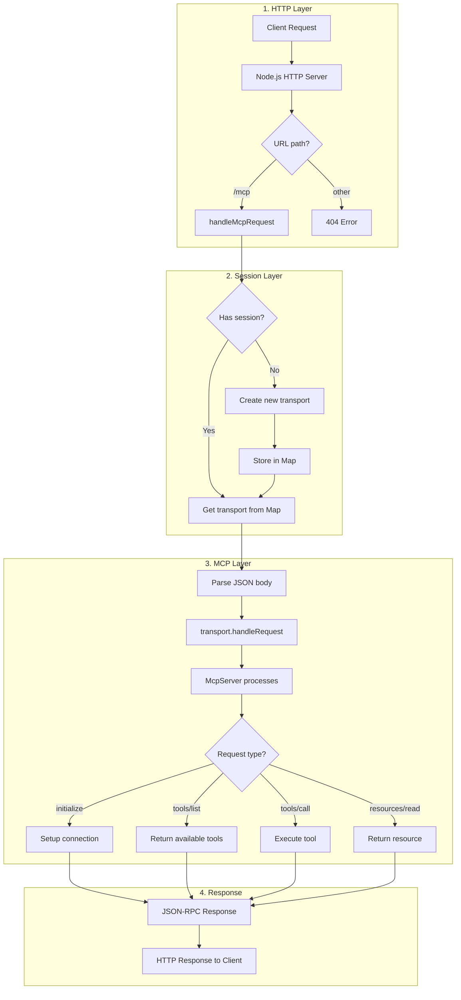

---

## Usage Example

Here's how to use `http.ts` in your application:

### Basic Usage

```typescript
// index.ts
import { McpServer } from "@modelcontextprotocol/sdk/server/mcp.js";
import { createMcpHttpServer } from "./http.js";

// Factory function - called for each new session
const createServer = () => {
  const server = new McpServer(
    { name: "my-server", version: "1.0.0" },
    { capabilities: { tools: {} } }
  );

  // Register a simple tool
  server.registerTool(
    "greet",
    { description: "Says hello" },
    async ({ name }) => ({
      content: [{ type: "text", text: `Hello, ${name}!` }],
    })
  );

  return server;
};

// Create and start the server
const mcp = createMcpHttpServer({
  createServer,
  port: 3001,
  path: "/mcp",
});

mcp.start();

// Graceful shutdown
process.on("SIGINT", () => mcp.stop().then(() => process.exit(0)));
```

### Testing with curl

```bash
# Initialize a session
curl -X POST http://localhost:3001/mcp \
  -H "Content-Type: application/json" \
  -d '{"jsonrpc":"2.0","id":1,"method":"initialize","params":{"protocolVersion":"2024-11-05","capabilities":{},"clientInfo":{"name":"test","version":"1.0"}}}'

# List available tools (use session ID from previous response)
curl -X POST http://localhost:3001/mcp \
  -H "Content-Type: application/json" \
  -H "Mcp-Session-Id: YOUR-SESSION-ID" \
  -d '{"jsonrpc":"2.0","id":2,"method":"tools/list"}'

# Call a tool
curl -X POST http://localhost:3001/mcp \
  -H "Content-Type: application/json" \
  -H "Mcp-Session-Id: YOUR-SESSION-ID" \
  -d '{"jsonrpc":"2.0","id":3,"method":"tools/call","params":{"name":"greet","arguments":{"name":"World"}}}'
```

---

## Summary

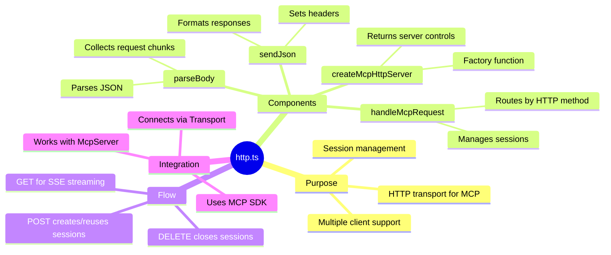

The `http.ts` module is a bridge between HTTP and MCP:
- It receives HTTP requests
- Manages client sessions
- Delegates to the MCP SDK for protocol handling
- Returns properly formatted responses

This abstraction lets you focus on building tools and resources while the transport layer handles all the communication complexity.
