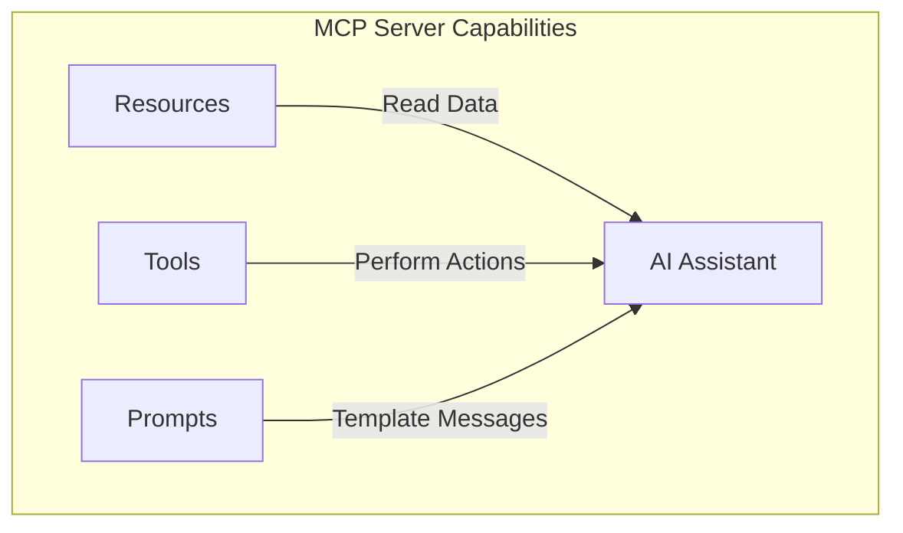
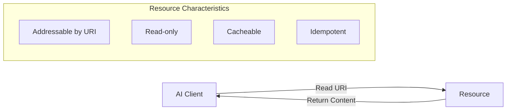
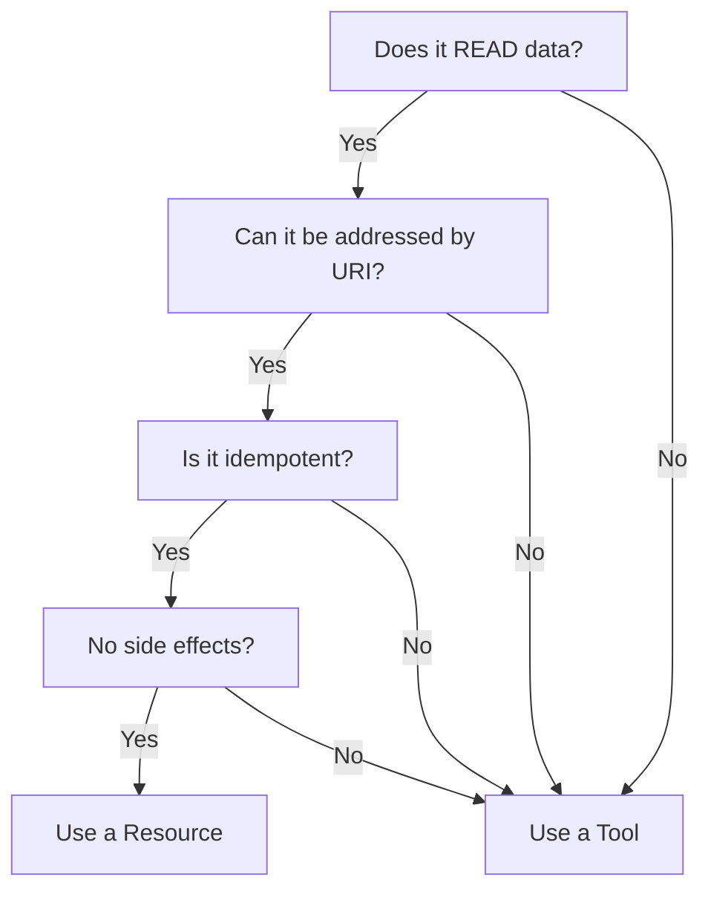
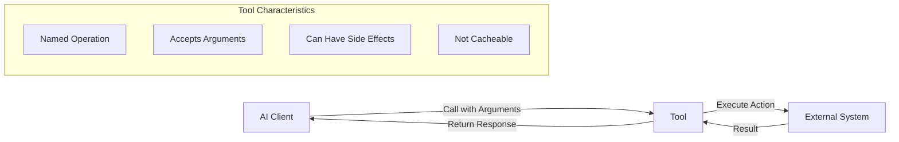
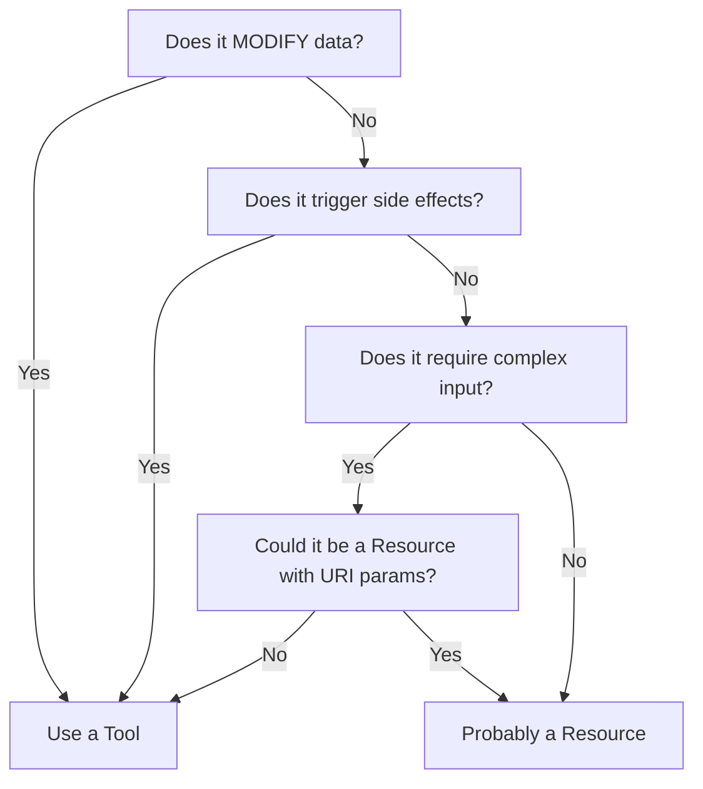
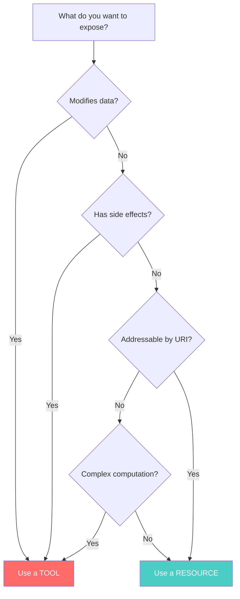
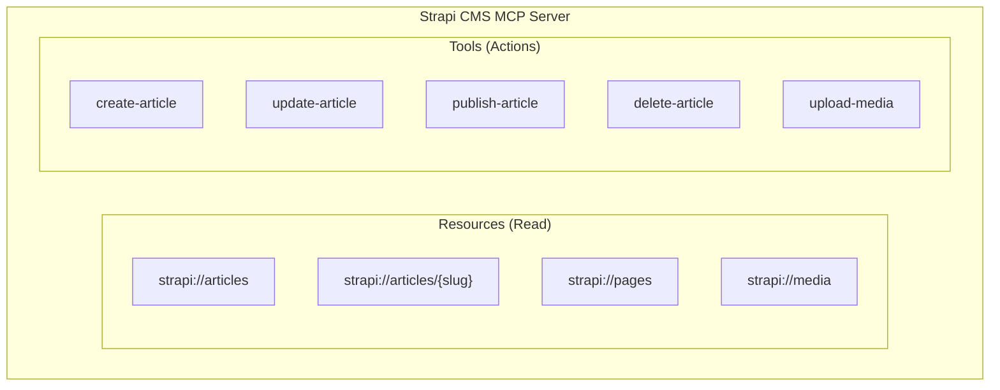
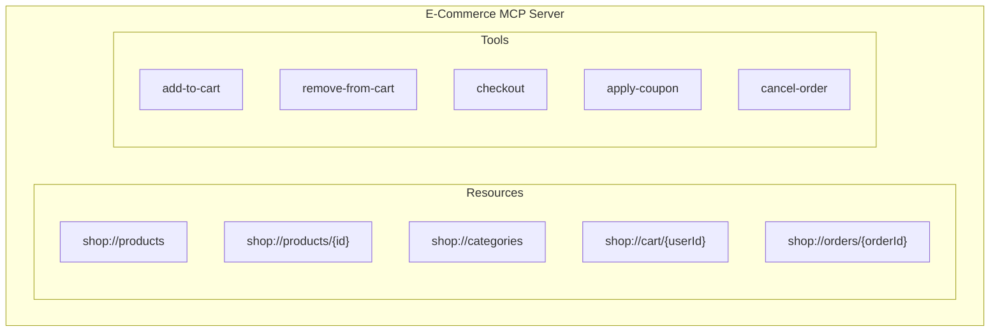
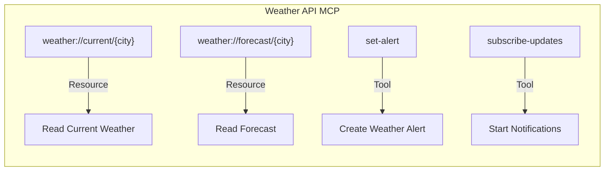
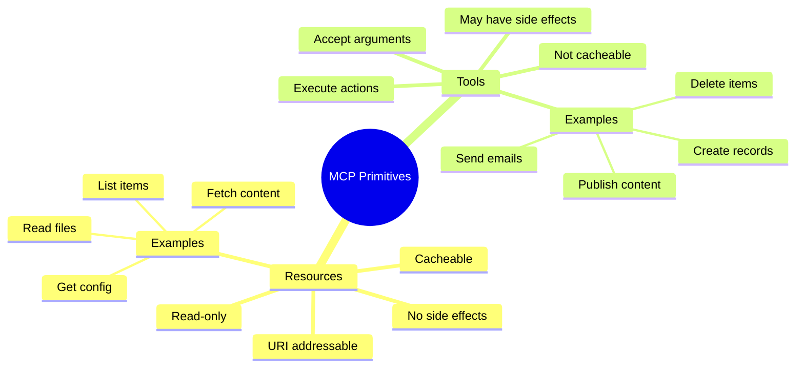

# MCP Resources vs Tools: A Complete Guide

A comprehensive guide to help you decide when to use Resources versus Tools in the Model Context Protocol (MCP).

## Table of Contents

1. [Overview](#overview)
2. [Resources Explained](#resources-explained)
3. [Tools Explained](#tools-explained)
4. [Decision Framework](#decision-framework)
5. [Real-World Examples](#real-world-examples)
6. [Common Mistakes](#common-mistakes)
7. [Migration Guide](#migration-guide)

---

## Overview

MCP provides two primary ways to expose functionality to AI assistants:



Think of it like a web API:
- **Resources** = GET endpoints (retrieve data)
- **Tools** = POST/PUT/DELETE endpoints (perform actions)

### Quick Comparison

| Feature | Resources | Tools |
|---------|-----------|-------|
| Primary purpose | Read data | Execute actions |
| Side effects | Never | Often |
| Cacheable | Yes | No |
| Addressable | By URI | By name + arguments |
| HTTP analogy | GET | POST, PUT, DELETE |
| Database analogy | SELECT | INSERT, UPDATE, DELETE |

---

## Resources Explained

### What Are Resources?

Resources represent **data that can be read**. They are identified by URIs (Uniform Resource Identifiers) and return content that the AI can consume.



### Resource Characteristics

1. **URI-Addressable**: Every resource has a unique address
   ```
   mcp://my-server/articles
   mcp://my-server/articles/hello-world
   mcp://my-server/users/123/profile
   ```

2. **Read-Only**: Resources never modify data
   ```typescript
   // Resource just reads and returns data
   async () => {
     const data = await database.query("SELECT * FROM articles");
     return { contents: [{ uri, text: JSON.stringify(data) }] };
   }
   ```

3. **Idempotent**: Reading the same URI always returns the same data (at that point in time)

4. **Cacheable**: Clients can cache resource responses

### Types of Resources

#### Static Resources
Fixed URI, fixed content structure:

```typescript
server.registerResource(
  "config",
  "mcp://app/config",
  { description: "Application configuration" },
  async () => ({
    contents: [{
      uri: "mcp://app/config",
      text: JSON.stringify({ version: "1.0", env: "production" })
    }]
  })
);
```

#### Dynamic Resources (Templates)
URI with parameters, content varies based on parameters:

```typescript
server.registerResource(
  "user-profile",
  new ResourceTemplate("mcp://app/users/{userId}", { list: undefined }),
  { description: "Get user profile by ID" },
  async (uri, { userId }) => {
    const user = await getUser(userId);
    return {
      contents: [{
        uri: uri.href,
        text: JSON.stringify(user)
      }]
    };
  }
);
```

### When to Use Resources



**Use Resources for:**
- Fetching content (articles, pages, products)
- Reading configuration or settings
- Listing collections of items
- Retrieving user profiles or account data
- Accessing files or documents
- Querying read-only APIs

---

## Tools Explained

### What Are Tools?

Tools represent **actions that can be performed**. They accept structured input, execute operations, and return results. Tools can have side effects.



### Tool Characteristics

1. **Named Operations**: Tools have a name and description
   ```typescript
   server.registerTool(
     "send-email",           // name
     { description: "Send an email to a recipient" },
     async (args) => { /* ... */ }
   );
   ```

2. **Structured Input**: Tools accept validated arguments
   ```typescript
   {
     inputSchema: {
       to: z.string().email(),
       subject: z.string(),
       body: z.string()
     }
   }
   ```

3. **Side Effects**: Tools often modify state or trigger actions
   ```typescript
   // Tool modifies data
   async ({ articleId, status }) => {
     await database.update("articles", articleId, { status });
     await notifySubscribers(articleId);
     return { content: [{ type: "text", text: "Article published!" }] };
   }
   ```

4. **Not Cacheable**: Results may differ even with same inputs

### When to Use Tools



**Use Tools for:**
- Creating, updating, or deleting records
- Sending emails, notifications, or messages
- Triggering workflows or background jobs
- Publishing or unpublishing content
- Processing payments or transactions
- Any operation with side effects

---

## Decision Framework

### The CRUD Mapping

| Operation | HTTP | Database | MCP |
|-----------|------|----------|-----|
| Create | POST | INSERT | **Tool** |
| Read | GET | SELECT | **Resource** |
| Update | PUT/PATCH | UPDATE | **Tool** |
| Delete | DELETE | DELETE | **Tool** |

### Decision Tree



### Quick Checklist

Ask yourself these questions:

#### Choose RESOURCE if:
- [ ] It only reads/retrieves data
- [ ] It can be represented as a URI path
- [ ] Calling it twice returns the same result
- [ ] It has no side effects whatsoever
- [ ] The data could be cached

#### Choose TOOL if:
- [ ] It creates, updates, or deletes data
- [ ] It sends notifications or triggers events
- [ ] It interacts with external services (write operations)
- [ ] The result depends on when it's called
- [ ] It requires complex validation or business logic

---

## Real-World Examples

### Example 1: Content Management System (CMS)



```typescript
// RESOURCES - Reading content
server.registerResource(
  "articles",
  "strapi://articles",
  { description: "List all articles" },
  async () => {
    const articles = await strapi.find("articles");
    return { contents: [{ uri: "strapi://articles", text: JSON.stringify(articles) }] };
  }
);

server.registerResource(
  "article",
  new ResourceTemplate("strapi://articles/{slug}", { list: undefined }),
  { description: "Get article by slug" },
  async (uri, { slug }) => {
    const article = await strapi.findOne("articles", { slug });
    return { contents: [{ uri: uri.href, text: JSON.stringify(article) }] };
  }
);

// TOOLS - Modifying content
server.registerTool(
  "create-article",
  {
    description: "Create a new article",
    inputSchema: {
      title: z.string(),
      content: z.string(),
      slug: z.string()
    }
  },
  async ({ title, content, slug }) => {
    const article = await strapi.create("articles", { title, content, slug });
    return { content: [{ type: "text", text: `Created article: ${article.id}` }] };
  }
);

server.registerTool(
  "publish-article",
  {
    description: "Publish an article (makes it live)",
    inputSchema: {
      articleId: z.number()
    }
  },
  async ({ articleId }) => {
    await strapi.update("articles", articleId, { status: "published" });
    await sendNotifications(articleId); // Side effect!
    return { content: [{ type: "text", text: "Article published!" }] };
  }
);
```

### Example 2: E-Commerce Platform



| Operation | Type | Why? |
|-----------|------|------|
| List products | Resource | Read-only, cacheable |
| Get product details | Resource | Read-only, URI-addressable |
| View cart | Resource | Read-only (current state) |
| Add to cart | **Tool** | Modifies cart state |
| Checkout | **Tool** | Creates order, charges payment |
| View order | Resource | Read-only |
| Cancel order | **Tool** | Modifies order, triggers refund |

### Example 3: Database Interface

```typescript
// RESOURCE: Query data (read-only)
server.registerResource(
  "query-results",
  new ResourceTemplate("db://query/{table}", { list: undefined }),
  { description: "Query a database table" },
  async (uri, { table }) => {
    // Safe: only SELECT
    const results = await db.select(table);
    return { contents: [{ uri: uri.href, text: JSON.stringify(results) }] };
  }
);

// TOOL: Execute arbitrary SQL (potentially dangerous)
server.registerTool(
  "execute-sql",
  {
    description: "Execute a SQL statement",
    inputSchema: {
      sql: z.string(),
      params: z.array(z.unknown()).optional()
    }
  },
  async ({ sql, params }) => {
    // Could be INSERT, UPDATE, DELETE
    const result = await db.execute(sql, params);
    return { content: [{ type: "text", text: JSON.stringify(result) }] };
  }
);
```

### Example 4: External API Integration



---

## Common Mistakes

### Mistake 1: Using Tools for Read-Only Operations

```typescript
// BAD: This should be a Resource
server.registerTool(
  "get-user",
  {
    description: "Get user by ID",
    inputSchema: { userId: z.string() }
  },
  async ({ userId }) => {
    const user = await getUser(userId);
    return { content: [{ type: "text", text: JSON.stringify(user) }] };
  }
);

// GOOD: This is a Resource
server.registerResource(
  "user",
  new ResourceTemplate("mcp://app/users/{userId}", { list: undefined }),
  { description: "Get user by ID" },
  async (uri, { userId }) => {
    const user = await getUser(userId);
    return { contents: [{ uri: uri.href, text: JSON.stringify(user) }] };
  }
);
```

**Why it matters:**
- Resources can be cached
- Resources have a consistent addressing scheme
- AI can browse resources like files
- Resources are inherently safer (no side effects)

### Mistake 2: Using Resources for Actions

```typescript
// BAD: This should be a Tool (has side effects)
server.registerResource(
  "send-email",
  new ResourceTemplate("mcp://app/send-email/{to}/{subject}", { list: undefined }),
  { description: "Send an email" },
  async (uri, { to, subject }) => {
    await emailService.send(to, subject, "Hello!"); // SIDE EFFECT!
    return { contents: [{ uri: uri.href, text: "Email sent" }] };
  }
);

// GOOD: This is a Tool
server.registerTool(
  "send-email",
  {
    description: "Send an email",
    inputSchema: {
      to: z.string().email(),
      subject: z.string(),
      body: z.string()
    }
  },
  async ({ to, subject, body }) => {
    await emailService.send(to, subject, body);
    return { content: [{ type: "text", text: "Email sent successfully" }] };
  }
);
```

**Why it matters:**
- Reading a resource should be safe/repeatable
- Clients might prefetch or cache resources
- Side effects in resources are unexpected and dangerous

### Mistake 3: Overly Complex Resource URIs

```typescript
// BAD: Too many parameters, complex logic
server.registerResource(
  "search",
  new ResourceTemplate(
    "mcp://app/search/{query}/{filters}/{sort}/{page}/{limit}",
    { list: undefined }
  ),
  async (uri, params) => { /* complex search logic */ }
);

// BETTER: Use a Tool for complex queries
server.registerTool(
  "search",
  {
    description: "Search with filters",
    inputSchema: {
      query: z.string(),
      filters: z.object({
        category: z.string().optional(),
        minPrice: z.number().optional(),
        maxPrice: z.number().optional()
      }).optional(),
      sort: z.enum(["relevance", "price", "date"]).optional(),
      pagination: z.object({
        page: z.number(),
        limit: z.number()
      }).optional()
    }
  },
  async (params) => { /* search logic */ }
);
```

**Rule of thumb:** If your Resource URI has more than 2-3 parameters, consider if a Tool might be clearer.

---

## Migration Guide

### Converting Tools to Resources

If you have tools that only read data, here's how to convert them:

#### Before (Tool)
```typescript
server.registerTool(
  "get-articles",
  {
    description: "Get all articles",
    inputSchema: {}
  },
  async () => {
    const articles = await fetchArticles();
    return {
      content: [{ type: "text", text: JSON.stringify(articles) }]
    };
  }
);

server.registerTool(
  "get-article",
  {
    description: "Get article by slug",
    inputSchema: { slug: z.string() }
  },
  async ({ slug }) => {
    const article = await fetchArticle(slug);
    return {
      content: [{ type: "text", text: JSON.stringify(article) }]
    };
  }
);
```

#### After (Resource)
```typescript
server.registerResource(
  "articles",
  "mcp://cms/articles",
  { description: "Get all articles", mimeType: "application/json" },
  async () => {
    const articles = await fetchArticles();
    return {
      contents: [{ uri: "mcp://cms/articles", text: JSON.stringify(articles) }]
    };
  }
);

server.registerResource(
  "article",
  new ResourceTemplate("mcp://cms/articles/{slug}", { list: undefined }),
  { description: "Get article by slug", mimeType: "application/json" },
  async (uri, { slug }) => {
    const value = Array.isArray(slug) ? slug[0] : slug;
    const article = await fetchArticle(value);
    return {
      contents: [{ uri: uri.href, text: JSON.stringify(article) }]
    };
  }
);
```

### Key Changes

| Aspect | Tool | Resource |
|--------|------|----------|
| Registration | `registerTool` | `registerResource` |
| Input | `inputSchema` object | URI or `ResourceTemplate` |
| Response | `content: [{ type, text }]` | `contents: [{ uri, text }]` |
| Parameters | Function arguments | URI variables |

---

## Summary



### Golden Rules

1. **If it only reads data** → Resource
2. **If it modifies anything** → Tool
3. **If it triggers notifications/events** → Tool
4. **If you'd cache the result** → Resource
5. **If calling twice has different effects** → Tool

### Still Unsure?

Ask yourself: "Would I be comfortable if this was called 100 times by accident?"

- **Yes, no problem** → Probably a Resource
- **No, that could be bad** → Definitely a Tool
