# Building a Pokemon Battle MCP Server: Step-by-Step Tutorial

Learn how to build a Model Context Protocol (MCP) server from scratch that simulates Pokemon battles and provides Pokemon data to AI assistants like Claude.

## Table of Contents

1. [What is MCP?](#what-is-mcp)
2. [Anatomy of an MCP Server](#anatomy-of-an-mcp-server)
3. [Prerequisites](#prerequisites)
4. [Project Setup](#project-setup)
5. [Understanding Transports: HTTP vs stdio](#understanding-transports-http-vs-stdio)
6. [Building the HTTP Transport (Detailed)](#building-the-http-transport-detailed)
7. [Creating Pokemon Utilities](#creating-pokemon-utilities)
8. [Understanding Tools](#understanding-tools)
9. [Building the Battle Tool](#building-the-battle-tool)
10. [Understanding Resources](#understanding-resources)
11. [Creating Pokemon Resources](#creating-pokemon-resources)
12. [Wiring Everything Together](#wiring-everything-together)
13. [Testing with MCP Inspector](#testing-with-mcp-inspector)
14. [Connecting to Claude Desktop](#connecting-to-claude-desktop)

---

## What is MCP?

### The Problem MCP Solves

AI assistants like Claude are powerful, but they're isolated. They can't:
- Access your files
- Query your databases
- Call your APIs
- Use your custom tools

**MCP (Model Context Protocol)** solves this by creating a standard way for AI to communicate with external systems.

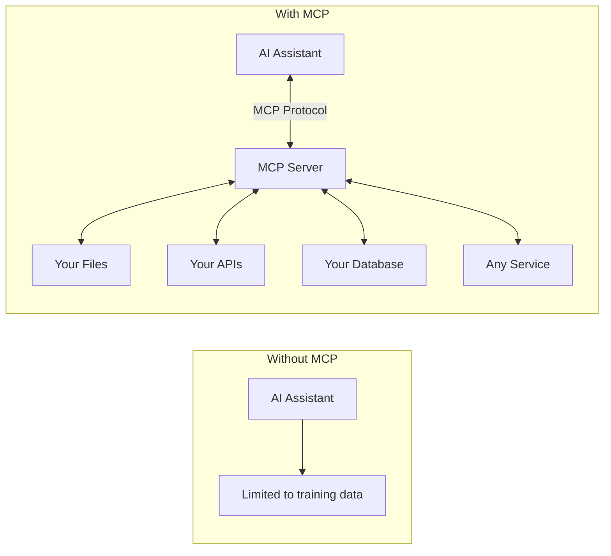

### How MCP Works

MCP uses a **client-server model**:

1. **MCP Client** (the AI assistant) sends requests
2. **MCP Server** (your code) handles requests and returns responses
3. Communication happens over a **transport** (HTTP, stdio, etc.)

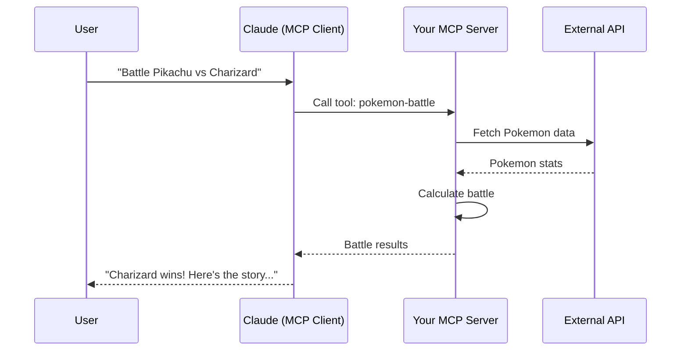

---

## Anatomy of an MCP Server

### Required Components

Every MCP server needs these core components:

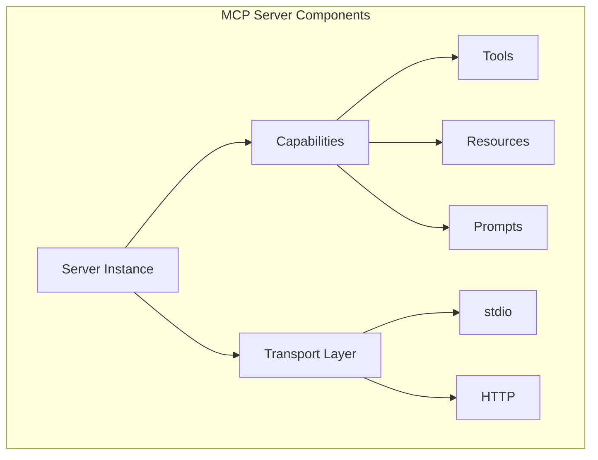

| Component | Required? | Purpose |
|-----------|-----------|---------|
| **Server Instance** | Yes | The core MCP server object |
| **Transport** | Yes | How messages travel (HTTP or stdio) |
| **Tools** | No* | Actions the AI can execute |
| **Resources** | No* | Data the AI can read |
| **Prompts** | No | Pre-defined prompt templates |

*At least one of Tools or Resources is needed for a useful server.

### Server Instance

The server instance is created using `McpServer` from the SDK:

```typescript
import { McpServer } from "@modelcontextprotocol/sdk/server/mcp.js";

const server = new McpServer(
  // First argument: Server identification
  {
    name: "my-server",      // Unique name for your server
    version: "1.0.0",       // Version string
  },
  // Second argument: Server options
  {
    instructions: "Description of what your server does",
    capabilities: {
      tools: {},       // Enable tools
      resources: {},   // Enable resources
      logging: {},     // Enable logging
    },
  }
);
```

**Breaking this down:**

| Parameter | Purpose |
|-----------|---------|
| `name` | Identifies your server to clients |
| `version` | Helps with compatibility |
| `instructions` | Tells AI how to use your server |
| `capabilities` | Declares what features are available |

### What are Capabilities?

Capabilities tell the MCP client what your server can do:

```typescript
capabilities: {
  tools: {},      // "I have tools you can call"
  resources: {},  // "I have resources you can read"
  logging: {},    // "I can send log messages"
  prompts: {},    // "I have prompt templates"
}
```

If you don't declare a capability, the client won't ask for it.

---

## Prerequisites

Before starting, ensure you have:

- **Node.js** v18 or higher
- **npm** or **yarn** package manager
- **Basic TypeScript knowledge**
- **A code editor** (VS Code recommended)

Verify your Node.js version:

```bash
node --version  # Should be v18.x or higher
```

---

## Project Setup

### Step 1: Create Project Directory

```bash
mkdir pokemon-battle-mcp
cd pokemon-battle-mcp
```

**What this does:** Creates a new folder for our project and navigates into it.

### Step 2: Initialize the Project

```bash
npm init -y
```

**What this does:** Creates a `package.json` file with default values. The `-y` flag accepts all defaults.

### Step 3: Update package.json

Open `package.json` and replace its contents with:

```json
{
  "name": "pokemon-battle-mcp",
  "version": "1.0.0",
  "type": "module",
  "main": "dist/index.js",
  "scripts": {
    "build": "tsc",
    "start": "node dist/index.js",
    "dev": "tsc && concurrently -n server,inspector \"node dist/index.js\" \"npx @modelcontextprotocol/inspector\""
  },
  "dependencies": {
    "@modelcontextprotocol/sdk": "^1.24.3",
    "zod": "^4.1.13"
  },
  "devDependencies": {
    "@types/node": "^22.0.0",
    "concurrently": "^9.2.1",
    "typescript": "^5.7.0"
  }
}
```

**Let's break down each part:**

| Field | Value | Purpose |
|-------|-------|---------|
| `"type": "module"` | `"module"` | Enables ES modules (import/export syntax) |
| `"main"` | `"dist/index.js"` | Entry point after TypeScript compilation |
| `"build"` | `"tsc"` | Compiles TypeScript to JavaScript |
| `"start"` | `"node dist/index.js"` | Runs the compiled server |
| `"dev"` | (long command) | Builds and runs server + inspector together |

**Dependencies explained:**

| Package | Purpose |
|---------|---------|
| `@modelcontextprotocol/sdk` | Official MCP SDK with server classes |
| `zod` | Schema validation for tool inputs |
| `@types/node` | TypeScript types for Node.js |
| `concurrently` | Run multiple commands in parallel |
| `typescript` | TypeScript compiler |

### Step 4: Install Dependencies

```bash
npm install
```

**What this does:** Downloads all packages listed in `package.json` into `node_modules/`.

### Step 5: Create TypeScript Configuration

Create `tsconfig.json`:

```json
{
  "compilerOptions": {
    "target": "ES2022",
    "module": "NodeNext",
    "moduleResolution": "NodeNext",
    "outDir": "./dist",
    "rootDir": "./src",
    "strict": true,
    "esModuleInterop": true,
    "skipLibCheck": true,
    "forceConsistentCasingInFileNames": true,
    "declaration": true
  },
  "include": ["src/**/*"],
  "exclude": ["node_modules", "dist"]
}
```

**Key options explained:**

| Option | Value | Purpose |
|--------|-------|---------|
| `target` | `"ES2022"` | JavaScript version to compile to |
| `module` | `"NodeNext"` | Use Node.js ES module system |
| `outDir` | `"./dist"` | Where compiled JS goes |
| `rootDir` | `"./src"` | Where source TS files are |
| `strict` | `true` | Enable all strict type checks |

### Step 6: Create Project Structure

```bash
mkdir -p src/utils src/tools src/resources
```

**What this does:** Creates nested directories. The `-p` flag creates parent directories if they don't exist.

Your project should now look like:

```
pokemon-battle-mcp/
├── package.json
├── tsconfig.json
├── node_modules/
└── src/
    ├── utils/       # Helper functions
    ├── tools/       # MCP tools
    └── resources/   # MCP resources
```

### Step 7: Create .gitignore

Create `.gitignore`:

```
node_modules/
dist/
*.log
.DS_Store
```

**What this does:** Tells Git which files to ignore. We don't want to commit `node_modules/` (large, can be reinstalled) or `dist/` (generated from source).

---

## Understanding Transports: HTTP vs stdio

### What is a Transport?

A transport is **how messages travel** between the MCP client (AI) and your MCP server.

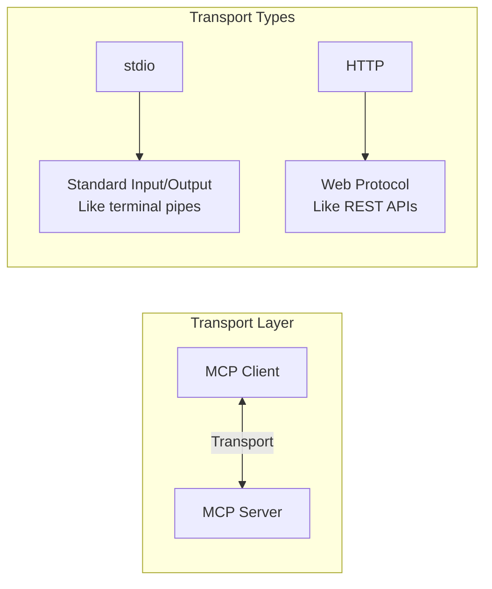

### stdio Transport

**stdio** (Standard Input/Output) uses terminal pipes:

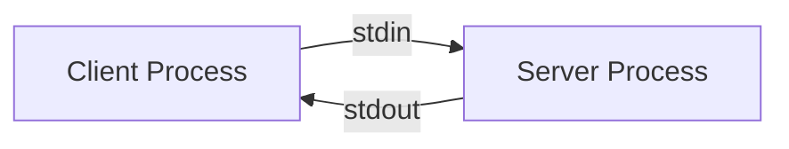

**Characteristics:**
- Client spawns server as a child process
- Messages flow through stdin/stdout
- Simple, no network required
- Single client only
- Used by Claude Desktop for local servers

**Example stdio server:**

```typescript
import { McpServer } from "@modelcontextprotocol/sdk/server/mcp.js";
import { StdioServerTransport } from "@modelcontextprotocol/sdk/server/stdio.js";

const server = new McpServer({ name: "my-server", version: "1.0.0" });

// stdio transport - reads from stdin, writes to stdout
const transport = new StdioServerTransport();
await server.connect(transport);
```

### HTTP Transport (Streamable HTTP)

**HTTP** uses web requests:

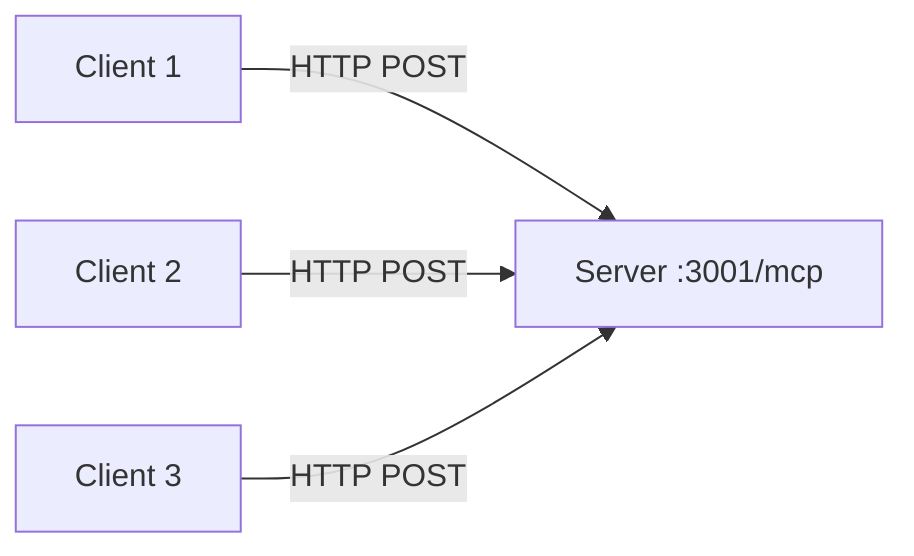

**Characteristics:**
- Server runs independently as web service
- Multiple clients can connect
- Works over networks
- More complex to set up
- Good for production/remote access

**When to use which:**

| Use Case | Transport |
|----------|-----------|
| Local development with Claude Desktop | stdio |
| Multiple AI clients | HTTP |
| Remote/cloud deployment | HTTP |
| Simple single-user setup | stdio |

**In this tutorial, we use HTTP** because it's more flexible and helps you understand how MCP works at a deeper level.

---

## Building the HTTP Transport (Detailed)

Let's build our HTTP transport layer with detailed explanations.

### Step 1: Create the HTTP Server Helper

Create `src/http.ts`. We'll build it piece by piece:

#### Part 1: Imports

```typescript
import { createServer, IncomingMessage, ServerResponse, Server } from "http";
import { McpServer } from "@modelcontextprotocol/sdk/server/mcp.js";
import { StreamableHTTPServerTransport } from "@modelcontextprotocol/sdk/server/streamableHttp.js";
import { randomUUID } from "crypto";
```

**What each import does:**

| Import | From | Purpose |
|--------|------|---------|
| `createServer` | `http` | Node.js function to create HTTP server |
| `IncomingMessage` | `http` | Type for incoming HTTP requests |
| `ServerResponse` | `http` | Type for HTTP responses |
| `Server` | `http` | Type for the server instance |
| `McpServer` | MCP SDK | The MCP server class |
| `StreamableHTTPServerTransport` | MCP SDK | Handles MCP-over-HTTP protocol |
| `randomUUID` | `crypto` | Generates unique session IDs |

#### Part 2: Type Definitions

```typescript
export interface McpHttpServerOptions {
  /** Factory function that creates a new McpServer instance per session */
  createServer: () => McpServer;
  /** Port to listen on (default: 3000) */
  port?: number;
  /** Path for MCP endpoint (default: "/mcp") */
  path?: string;
}

export interface McpHttpServer {
  server: Server;
  start: () => Promise<void>;
  stop: () => Promise<void>;
}
```

**Why these interfaces?**

`McpHttpServerOptions` defines what you pass IN:
- `createServer`: A function that creates your MCP server (called for each session)
- `port`: Which port to listen on
- `path`: URL path for the MCP endpoint

`McpHttpServer` defines what you get OUT:
- `server`: The raw HTTP server (for advanced use)
- `start()`: Function to start listening
- `stop()`: Function to gracefully shutdown

#### Part 3: The Main Function Signature

```typescript
export function createMcpHttpServer(options: McpHttpServerOptions): McpHttpServer {
  // Destructure options with defaults
  const { createServer: createMcpServer, port = 3000, path = "/mcp" } = options;

  // Store active sessions
  const transports = new Map<string, StreamableHTTPServerTransport>();
```

**What's happening:**

1. **Destructuring with defaults**: `port = 3000` means "use port 3000 if not specified"
2. **Renaming**: `createServer: createMcpServer` renames to avoid conflict with Node's `createServer`
3. **Session storage**: The `Map` stores active transports by session ID

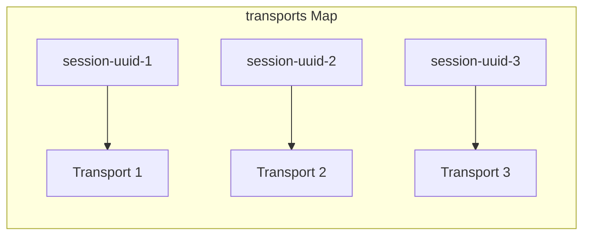

#### Part 4: Helper Functions

```typescript
  // Parse incoming request body as JSON
  async function parseBody(req: IncomingMessage): Promise<unknown> {
    return new Promise((resolve, reject) => {
      let body = "";

      // HTTP requests come as streams of chunks
      req.on("data", (chunk) => (body += chunk));

      // When all chunks received, parse JSON
      req.on("end", () => {
        try {
          resolve(body ? JSON.parse(body) : undefined);
        } catch (e) {
          reject(e);
        }
      });

      req.on("error", reject);
    });
  }
```

**Why is this needed?**

HTTP request bodies arrive in **chunks** (small pieces). We need to:
1. Collect all chunks
2. Combine them into a string
3. Parse as JSON

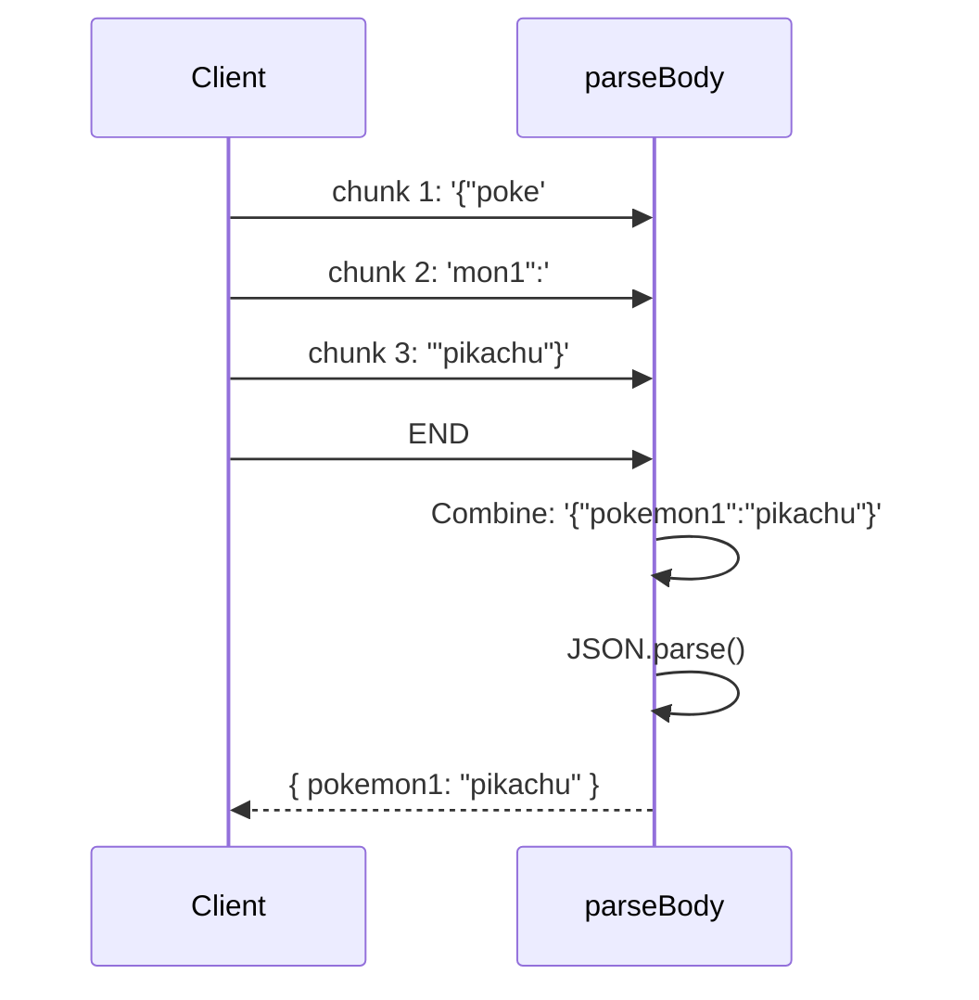

```typescript
  // Send JSON response
  function sendJson(res: ServerResponse, status: number, data: unknown) {
    res.writeHead(status, { "Content-Type": "application/json" });
    res.end(JSON.stringify(data));
  }
```

**What this does:**
1. `writeHead`: Sets HTTP status code and headers
2. `JSON.stringify`: Converts object to JSON string
3. `end`: Sends response and closes connection

#### Part 5: The MCP Request Handler

This is the core logic:

```typescript
  async function handleMcpRequest(req: IncomingMessage, res: ServerResponse) {
    // Get session ID from header (if exists)
    const sessionId = req.headers["mcp-session-id"] as string | undefined;
```

**Session IDs explained:**

MCP uses sessions to maintain state across requests. The session ID is sent in the `Mcp-Session-Id` header.

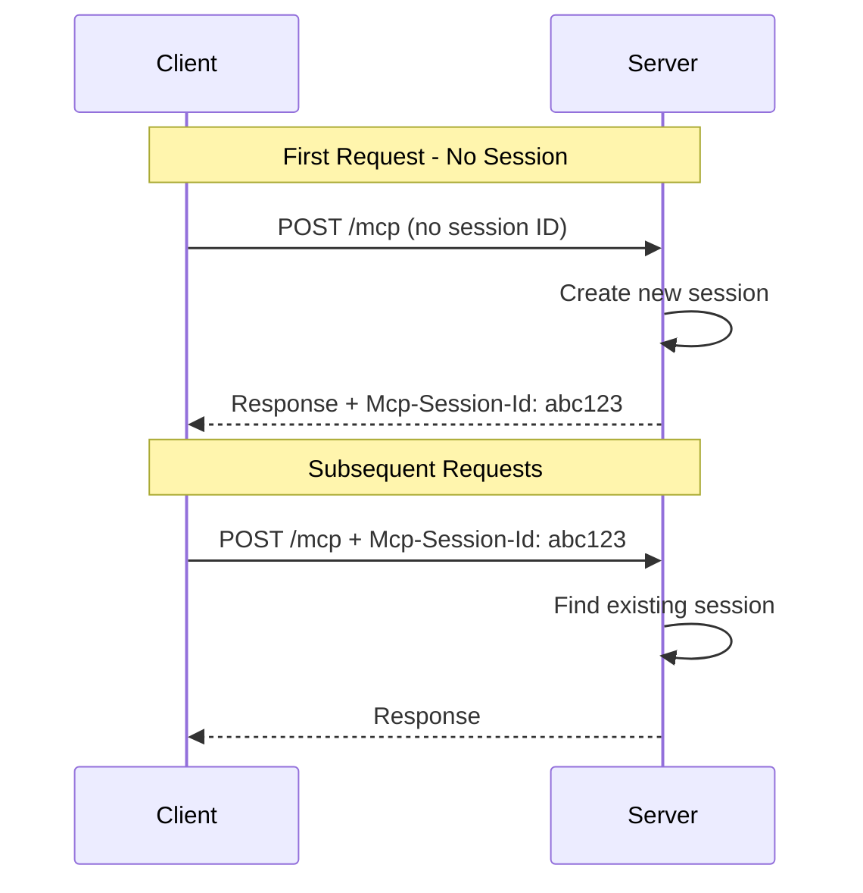

**Handling POST requests (main communication):**

```typescript
    if (req.method === "POST") {
      let transport: StreamableHTTPServerTransport;

      // Check if session already exists
      if (sessionId && transports.has(sessionId)) {
        // Reuse existing transport
        transport = transports.get(sessionId)!;
      } else {
        // Create new MCP server instance
        const mcpServer = createMcpServer();

        // Create new transport with session management
        transport = new StreamableHTTPServerTransport({
          // Function to generate session IDs
          sessionIdGenerator: () => randomUUID(),

          // Called when session is created
          onsessioninitialized: (id) => {
            transports.set(id, transport);
            console.log(`Session initialized: ${id}`);
          },
        });

        // Handle session cleanup
        transport.onclose = () => {
          if (transport.sessionId) {
            transports.delete(transport.sessionId);
            console.log(`Session closed: ${transport.sessionId}`);
          }
        };

        // Connect MCP server to transport
        await mcpServer.connect(transport);
      }

      // Parse request body and handle
      const body = await parseBody(req);
      await transport.handleRequest(req, res, body);
    }
```

**Flow diagram:**

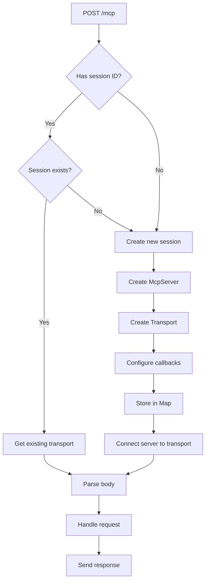

**Handling GET and DELETE:**

```typescript
    } else if (req.method === "GET" || req.method === "DELETE") {
      // These require an existing session
      if (!sessionId || !transports.has(sessionId)) {
        sendJson(res, 400, {
          jsonrpc: "2.0",
          error: { code: -32000, message: "Invalid or missing session ID" },
          id: null,
        });
        return;
      }

      const transport = transports.get(sessionId)!;
      await transport.handleRequest(req, res);
    } else {
      // Method not allowed
      sendJson(res, 405, {
        jsonrpc: "2.0",
        error: { code: -32000, message: "Method not allowed" },
        id: null,
      });
    }
  }
```

**HTTP methods in MCP:**

| Method | Purpose |
|--------|---------|
| POST | Send MCP messages (tool calls, etc.) |
| GET | Server-Sent Events for streaming |
| DELETE | Close a session |

#### Part 6: The HTTP Server

```typescript
  const httpServer = createServer(async (req, res) => {
    // Parse the URL to get the path
    const url = new URL(req.url || "/", `http://localhost:${port}`);

    // Only handle requests to our MCP path
    if (url.pathname === path) {
      try {
        await handleMcpRequest(req, res);
      } catch (error) {
        console.error("Error handling request:", error);
        // Don't send error if headers already sent
        if (!res.headersSent) {
          sendJson(res, 500, {
            jsonrpc: "2.0",
            error: { code: -32603, message: "Internal server error" },
            id: null,
          });
        }
      }
    } else {
      // Wrong path
      sendJson(res, 404, { error: "Not found" });
    }
  });
```

**What this does:**

1. `createServer` creates an HTTP server
2. The callback runs for every incoming request
3. We check if the URL path matches our MCP endpoint
4. If yes, handle as MCP request
5. If no, return 404

#### Part 7: Return Object

```typescript
  return {
    server: httpServer,

    // Start listening
    start: () =>
      new Promise((resolve) => {
        httpServer.listen(port, () => {
          console.log(`MCP server listening on http://localhost:${port}${path}`);
          resolve();
        });
      }),

    // Graceful shutdown
    stop: async () => {
      console.log("Shutting down...");
      // Close all active sessions
      for (const transport of transports.values()) {
        await transport.close();
      }
      httpServer.close();
    },
  };
}
```

**Why return these?**

| Property | Purpose |
|----------|---------|
| `server` | Access raw HTTP server if needed |
| `start()` | Begin accepting connections |
| `stop()` | Clean shutdown (close sessions first) |

### Complete http.ts File

Here's the complete file:

```typescript
import { createServer, IncomingMessage, ServerResponse, Server } from "http";
import { McpServer } from "@modelcontextprotocol/sdk/server/mcp.js";
import { StreamableHTTPServerTransport } from "@modelcontextprotocol/sdk/server/streamableHttp.js";
import { randomUUID } from "crypto";

export interface McpHttpServerOptions {
  createServer: () => McpServer;
  port?: number;
  path?: string;
}

export interface McpHttpServer {
  server: Server;
  start: () => Promise<void>;
  stop: () => Promise<void>;
}

export function createMcpHttpServer(options: McpHttpServerOptions): McpHttpServer {
  const { createServer: createMcpServer, port = 3000, path = "/mcp" } = options;
  const transports = new Map<string, StreamableHTTPServerTransport>();

  async function parseBody(req: IncomingMessage): Promise<unknown> {
    return new Promise((resolve, reject) => {
      let body = "";
      req.on("data", (chunk) => (body += chunk));
      req.on("end", () => {
        try {
          resolve(body ? JSON.parse(body) : undefined);
        } catch (e) {
          reject(e);
        }
      });
      req.on("error", reject);
    });
  }

  function sendJson(res: ServerResponse, status: number, data: unknown) {
    res.writeHead(status, { "Content-Type": "application/json" });
    res.end(JSON.stringify(data));
  }

  async function handleMcpRequest(req: IncomingMessage, res: ServerResponse) {
    const sessionId = req.headers["mcp-session-id"] as string | undefined;

    if (req.method === "POST") {
      let transport: StreamableHTTPServerTransport;

      if (sessionId && transports.has(sessionId)) {
        transport = transports.get(sessionId)!;
      } else {
        const mcpServer = createMcpServer();
        transport = new StreamableHTTPServerTransport({
          sessionIdGenerator: () => randomUUID(),
          onsessioninitialized: (id) => {
            transports.set(id, transport);
            console.log(`Session initialized: ${id}`);
          },
        });

        transport.onclose = () => {
          if (transport.sessionId) {
            transports.delete(transport.sessionId);
            console.log(`Session closed: ${transport.sessionId}`);
          }
        };

        await mcpServer.connect(transport);
      }

      const body = await parseBody(req);
      await transport.handleRequest(req, res, body);
    } else if (req.method === "GET" || req.method === "DELETE") {
      if (!sessionId || !transports.has(sessionId)) {
        sendJson(res, 400, {
          jsonrpc: "2.0",
          error: { code: -32000, message: "Invalid or missing session ID" },
          id: null,
        });
        return;
      }

      const transport = transports.get(sessionId)!;
      await transport.handleRequest(req, res);
    } else {
      sendJson(res, 405, {
        jsonrpc: "2.0",
        error: { code: -32000, message: "Method not allowed" },
        id: null,
      });
    }
  }

  const httpServer = createServer(async (req, res) => {
    const url = new URL(req.url || "/", `http://localhost:${port}`);

    if (url.pathname === path) {
      try {
        await handleMcpRequest(req, res);
      } catch (error) {
        console.error("Error handling request:", error);
        if (!res.headersSent) {
          sendJson(res, 500, {
            jsonrpc: "2.0",
            error: { code: -32603, message: "Internal server error" },
            id: null,
          });
        }
      }
    } else {
      sendJson(res, 404, { error: "Not found" });
    }
  });

  return {
    server: httpServer,
    start: () =>
      new Promise((resolve) => {
        httpServer.listen(port, () => {
          console.log(`MCP server listening on http://localhost:${port}${path}`);
          resolve();
        });
      }),
    stop: async () => {
      console.log("Shutting down...");
      for (const transport of transports.values()) {
        await transport.close();
      }
      httpServer.close();
    },
  };
}
```

---

## Creating Pokemon Utilities

Before building MCP tools and resources, let's create helper functions to interact with the PokeAPI.

### Step 1: Create Pokemon Utils

Create `src/utils/pokemon.ts`:

```typescript
// ===================
// TYPE DEFINITIONS
// ===================

// Basic Pokemon data for battles
export interface Pokemon {
  id: number;           // Pokemon's Pokedex number
  name: string;         // Pokemon's name (lowercase)
  types: string[];      // Array of types like ["fire", "flying"]
  stats: Record<string, number>;  // Stats like { "attack": 84, "defense": 78 }
  totalStats: number;   // Sum of all stats
}

// Extended Pokemon data for detailed views
export interface PokemonDetails extends Pokemon {
  height: number;       // Height in decimeters
  weight: number;       // Weight in hectograms
  abilities: string[];  // Array of ability names
}

// Simple Pokemon list item
export interface PokemonListItem {
  name: string;
  id: string;
}
```

**Why these types?**

Types help TypeScript catch errors and provide autocomplete. We define:
- `Pokemon`: Basic data needed for battles
- `PokemonDetails`: Extra data for the details resource
- `PokemonListItem`: Minimal data for listing

```typescript
// ===================
// CONSTANTS
// ===================

const POKEAPI_BASE = "https://pokeapi.co/api/v2";
```

**What's PokeAPI?**

[PokeAPI](https://pokeapi.co/) is a free REST API with Pokemon data. We'll fetch real stats from it.

```typescript
// ===================
// API FUNCTIONS
// ===================

/**
 * Fetch basic Pokemon data for battles
 * Returns null if Pokemon doesn't exist
 */
export async function fetchPokemon(name: string): Promise<Pokemon | null> {
  // Make HTTP request to PokeAPI
  const response = await fetch(
    `${POKEAPI_BASE}/pokemon/${name.toLowerCase()}`
  );

  // Return null if Pokemon not found (404) or other error
  if (!response.ok) return null;

  // Parse JSON response
  const data = await response.json();

  // Transform stats array into object
  // PokeAPI returns: [{ stat: { name: "attack" }, base_stat: 84 }, ...]
  // We want: { "attack": 84, "defense": 78, ... }
  const stats: Record<string, number> = {};
  data.stats.forEach((s: { stat: { name: string }; base_stat: number }) => {
    stats[s.stat.name] = s.base_stat;
  });

  // Return formatted Pokemon data
  return {
    id: data.id,
    name: data.name,
    types: data.types.map((t: { type: { name: string } }) => t.type.name),
    stats,
    totalStats: Object.values(stats).reduce((a, b) => a + b, 0),
  };
}
```

**Understanding the transformation:**

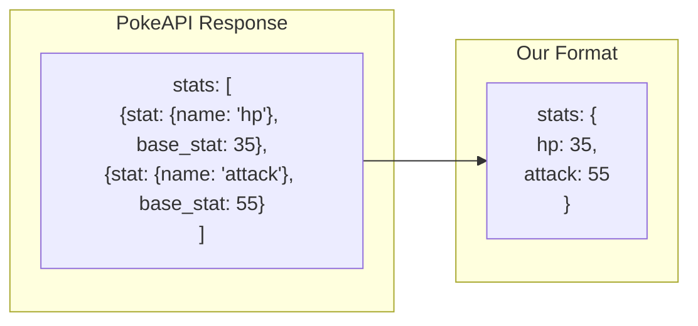

```typescript
/**
 * Fetch detailed Pokemon data for resources
 */
export async function fetchPokemonDetails(
  name: string
): Promise<PokemonDetails | null> {
  const response = await fetch(
    `${POKEAPI_BASE}/pokemon/${name.toLowerCase()}`
  );
  if (!response.ok) return null;

  const data = await response.json();
  const stats: Record<string, number> = {};
  data.stats.forEach((s: { stat: { name: string }; base_stat: number }) => {
    stats[s.stat.name] = s.base_stat;
  });

  return {
    id: data.id,
    name: data.name,
    height: data.height,
    weight: data.weight,
    types: data.types.map((t: { type: { name: string } }) => t.type.name),
    abilities: data.abilities.map(
      (a: { ability: { name: string } }) => a.ability.name
    ),
    stats,
    totalStats: Object.values(stats).reduce((a, b) => a + b, 0),
  };
}
```

**Difference from fetchPokemon:**

This includes extra fields (`height`, `weight`, `abilities`) for the details resource.

```typescript
/**
 * Fetch list of Pokemon (paginated)
 */
export async function fetchPokemonList(
  limit = 50
): Promise<PokemonListItem[]> {
  const response = await fetch(`${POKEAPI_BASE}/pokemon?limit=${limit}`);
  const data = await response.json();

  // Transform API response
  // API returns: { results: [{ name: "bulbasaur", url: ".../pokemon/1/" }, ...] }
  return data.results.map((p: { name: string; url: string }) => ({
    name: p.name,
    // Extract ID from URL: ".../pokemon/1/" -> "1"
    id: p.url.split("/").filter(Boolean).pop(),
  }));
}
```

**URL parsing explained:**

```
URL: "https://pokeapi.co/api/v2/pokemon/1/"

.split("/")     -> ["https:", "", "pokeapi.co", "api", "v2", "pokemon", "1", ""]
.filter(Boolean) -> ["https:", "pokeapi.co", "api", "v2", "pokemon", "1"]  (removes empty strings)
.pop()          -> "1"  (gets last element)
```

```typescript
// ===================
// BATTLE LOGIC
// ===================

/**
 * Calculate battle score for a Pokemon
 * Higher score = more likely to win
 */
export function calculateBattleScore(pokemon: Pokemon): number {
  // Extract individual stats (default to 0 if missing)
  const attack = pokemon.stats["attack"] || 0;
  const spAttack = pokemon.stats["special-attack"] || 0;
  const defense = pokemon.stats["defense"] || 0;
  const spDefense = pokemon.stats["special-defense"] || 0;
  const speed = pokemon.stats["speed"] || 0;
  const hp = pokemon.stats["hp"] || 0;

  // Calculate weighted score
  // Attack stats weighted higher (offensive advantage)
  const baseScore =
    attack * 1.2 +      // Physical attack: 20% bonus
    spAttack * 1.1 +    // Special attack: 10% bonus
    defense * 0.8 +     // Defense: 20% penalty
    spDefense * 0.7 +   // Special defense: 30% penalty
    speed * 1.0 +       // Speed: neutral
    hp * 0.9;           // HP: 10% penalty

  // Add randomness (10-20% variance)
  // This allows weaker Pokemon to sometimes win
  const randomFactor = 0.9 + Math.random() * 0.2;

  return Math.round(baseScore * randomFactor);
}
```

**Battle score visualization:**

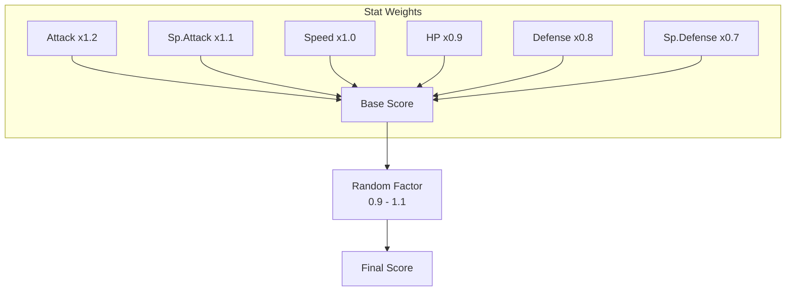

---

## Understanding Tools

### What are MCP Tools?

Tools are **actions** that an AI can execute. They're like functions the AI can call.

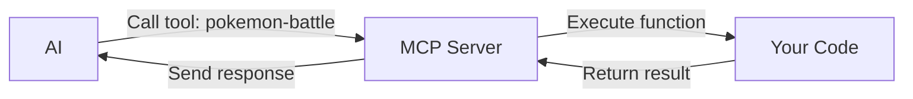

### Tool Definition Structure

Every tool has:

```typescript
server.registerTool(
  "tool-name",           // 1. Unique identifier
  {
    title: "Tool Title",          // 2. Human-readable name
    description: "What it does",  // 3. Helps AI decide when to use it
    inputSchema: {                // 4. Input validation with Zod
      param1: z.string(),
      param2: z.number().optional(),
    },
  },
  async (inputs) => {             // 5. Handler function
    // Your logic here
    return {
      content: [                  // 6. Response content
        { type: "text", text: "Result" }
      ]
    };
  }
);
```

### Tool Components Explained

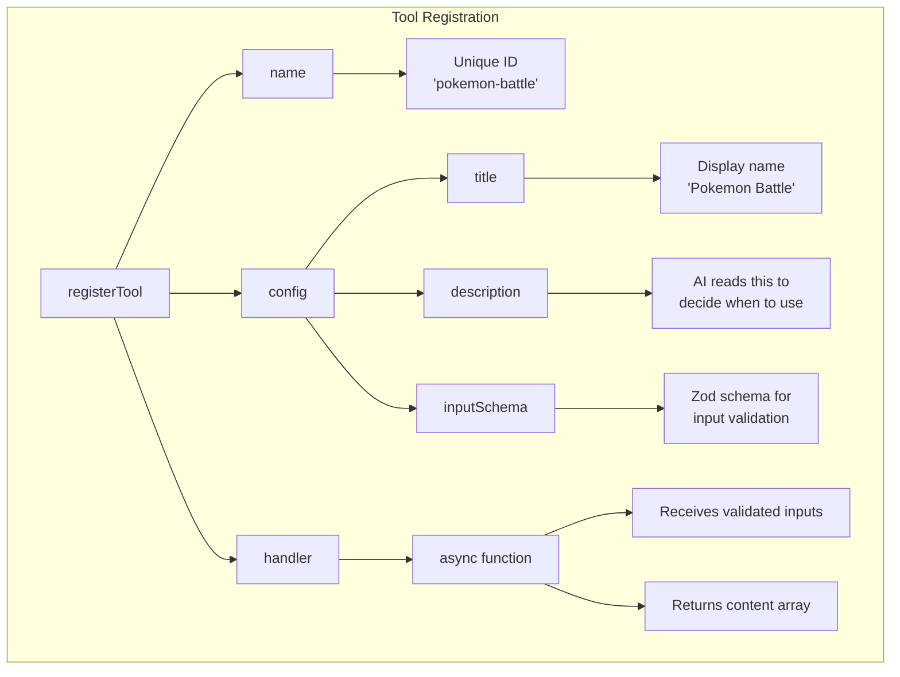

### Input Validation with Zod

Zod validates inputs before your handler runs:

```typescript
inputSchema: {
  pokemon1: z.string().describe("Name of first Pokemon"),
  pokemon2: z.string().describe("Name of second Pokemon"),
}
```

**Zod examples:**

| Zod Schema | Accepts |
|------------|---------|
| `z.string()` | Any string |
| `z.number()` | Any number |
| `z.boolean()` | true or false |
| `z.string().optional()` | String or undefined |
| `z.number().min(1).max(100)` | Number between 1-100 |
| `z.enum(["a", "b", "c"])` | Only "a", "b", or "c" |

### Response Format

Tools return content arrays:

```typescript
return {
  content: [
    { type: "text", text: "Result message" },
    { type: "text", text: "More details" },
  ],
  isError: false,  // Set true if operation failed
};
```

**Content types:**

| Type | Use Case |
|------|----------|
| `text` | Plain text or JSON |
| `image` | Base64 encoded images |

---

## Building the Battle Tool

Now let's build our Pokemon battle tool with detailed explanations.

### Step 1: Create the Battle Tool

Create `src/tools/pokemon-battle.ts`:

```typescript
// ===================
// IMPORTS
// ===================

import { McpServer } from "@modelcontextprotocol/sdk/server/mcp.js";
import * as z from "zod";
import {
  fetchPokemon,
  calculateBattleScore,
  Pokemon,
} from "../utils/pokemon.js";
```

**Import breakdown:**

| Import | Purpose |
|--------|---------|
| `McpServer` | Type for the server parameter |
| `z` (Zod) | Input validation library |
| `fetchPokemon` | Our API helper |
| `calculateBattleScore` | Our battle logic |
| `Pokemon` | TypeScript type |

```typescript
// ===================
// TOOL REGISTRATION
// ===================

/**
 * Register the Pokemon battle tool with the MCP server
 * This function is called from index.ts
 */
export function registerPokemonBattleTool(server: McpServer) {
  server.registerTool(
    // Tool identifier - used by AI to call this tool
    "pokemon-battle",

    // Tool configuration
    {
      title: "Pokemon Battle",
      description:
        "Simulate a battle between two Pokemon. Returns battle stats, winner, and requests AI to write an exciting battle narrative.",

      // Input schema using Zod
      inputSchema: {
        pokemon1: z.string().describe("Name of the first Pokemon"),
        pokemon2: z.string().describe("Name of the second Pokemon"),
      },
    },
```

**Why export as a function?**

This pattern lets us:
1. Keep tool code in separate files
2. Register multiple tools easily
3. Pass the server instance around

```typescript
    // Handler function - runs when AI calls this tool
    async ({ pokemon1, pokemon2 }) => {
      // ===================
      // FETCH POKEMON DATA
      // ===================

      // Fetch both Pokemon in parallel for speed
      const [fighter1, fighter2] = await Promise.all([
        fetchPokemon(pokemon1),
        fetchPokemon(pokemon2),
      ]);
```

**What's Promise.all?**

Instead of:
```typescript
const fighter1 = await fetchPokemon(pokemon1);  // Wait...
const fighter2 = await fetchPokemon(pokemon2);  // Then wait...
// Total: 2 API calls in sequence
```

We do:
```typescript
const [fighter1, fighter2] = await Promise.all([
  fetchPokemon(pokemon1),  // Start both
  fetchPokemon(pokemon2),  // at the same time
]);
// Total: 2 API calls in parallel (faster!)
```

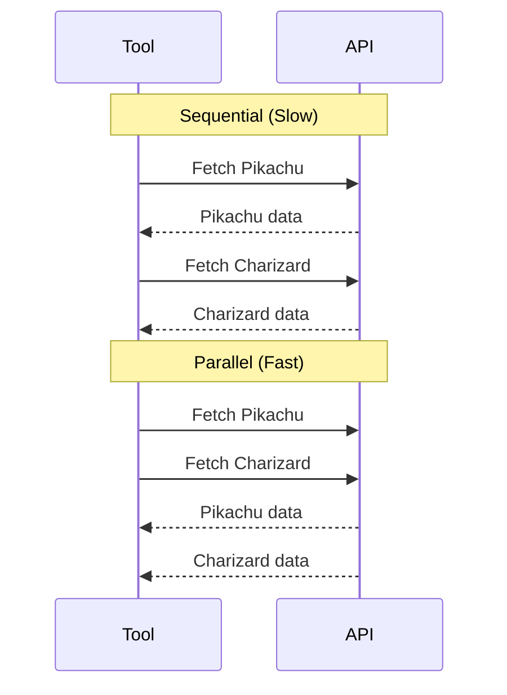

```typescript
      // ===================
      // VALIDATION
      // ===================

      // Check if both Pokemon exist
      const errors: string[] = [];
      if (!fighter1) {
        errors.push(`"${pokemon1}" is not a valid Pokemon`);
      }
      if (!fighter2) {
        errors.push(`"${pokemon2}" is not a valid Pokemon`);
      }

      // Return error if any Pokemon not found
      if (errors.length > 0) {
        return {
          content: [
            {
              type: "text",
              text: `Battle cannot proceed!\n\n${errors.join("\n")}\n\nPlease provide valid Pokemon names (e.g., pikachu, charizard, mewtwo).`,
            },
          ],
          isError: true,  // Tells AI this is an error
        };
      }
```

**Why validate both at once?**

If both Pokemon are invalid, the user sees both errors at once instead of fixing one, trying again, and then seeing the other error.

```typescript
      // ===================
      // BATTLE CALCULATION
      // ===================

      // TypeScript now knows these aren't null
      const pokemon1Data = fighter1 as Pokemon;
      const pokemon2Data = fighter2 as Pokemon;

      // Calculate battle scores
      const score1 = calculateBattleScore(pokemon1Data);
      const score2 = calculateBattleScore(pokemon2Data);

      // Determine winner and loser
      const winner = score1 > score2 ? pokemon1Data : pokemon2Data;
      const loser = score1 > score2 ? pokemon2Data : pokemon1Data;
      const winnerScore = Math.max(score1, score2);
      const loserScore = Math.min(score1, score2);

      // Was it a close battle? (within 50 points)
      const wasClose = Math.abs(score1 - score2) < 50;
```

**Ternary operator explained:**

```typescript
const winner = score1 > score2 ? pokemon1Data : pokemon2Data;
//            condition        ? if true      : if false
```

```typescript
      // ===================
      // BUILD RESPONSE
      // ===================

      // Structured battle report
      const battleReport = {
        battle: {
          fighter1: {
            name: pokemon1Data.name.toUpperCase(),
            types: pokemon1Data.types,
            stats: pokemon1Data.stats,
            totalStats: pokemon1Data.totalStats,
            battleScore: score1,
          },
          fighter2: {
            name: pokemon2Data.name.toUpperCase(),
            types: pokemon2Data.types,
            stats: pokemon2Data.stats,
            totalStats: pokemon2Data.totalStats,
            battleScore: score2,
          },
        },
        result: {
          winner: winner.name.toUpperCase(),
          loser: loser.name.toUpperCase(),
          winnerScore,
          loserScore,
          margin: winnerScore - loserScore,
          wasClose,
          victoryType: wasClose ? "narrow victory" : "decisive victory",
        },
      };
```

**Why structure data this way?**

The AI receives this JSON and can:
1. Reference specific stats in its response
2. Understand the battle outcome
3. Generate accurate narratives

```typescript
      // Prompt for AI to generate narrative
      const narrativePrompt = `
---
BATTLE COMPLETE! Please write an exciting 2-paragraph Pokemon battle story based on these results:

**${pokemon1Data.name.toUpperCase()}** (${pokemon1Data.types.join("/")}) vs **${pokemon2Data.name.toUpperCase()}** (${pokemon2Data.types.join("/")})

Winner: **${winner.name.toUpperCase()}** with a ${wasClose ? "narrow" : "decisive"} victory!

Key stats to reference:
- ${pokemon1Data.name}: Attack ${pokemon1Data.stats["attack"]}, Sp.Atk ${pokemon1Data.stats["special-attack"]}, Speed ${pokemon1Data.stats["speed"]}
- ${pokemon2Data.name}: Attack ${pokemon2Data.stats["attack"]}, Sp.Atk ${pokemon2Data.stats["special-attack"]}, Speed ${pokemon2Data.stats["speed"]}

Make it dramatic and reference their types and signature moves!
---`;
```

**Template literals:**

```typescript
`Hello ${name}!`  // Backticks allow ${} interpolation
```

The `${...}` parts are replaced with actual values.

```typescript
      // Return response to AI
      return {
        content: [
          {
            type: "text",
            text: JSON.stringify(battleReport, null, 2),
          },
          {
            type: "text",
            text: narrativePrompt,
          },
        ],
      };
    }
  );
}
```

**JSON.stringify parameters:**

```typescript
JSON.stringify(battleReport, null, 2)
//             object        replacer  indent
// null = no custom replacer
// 2 = indent with 2 spaces (pretty print)
```

---

## Understanding Resources

### What are MCP Resources?

Resources are **read-only data** that AI can access. Think of them as files or API endpoints the AI can read.

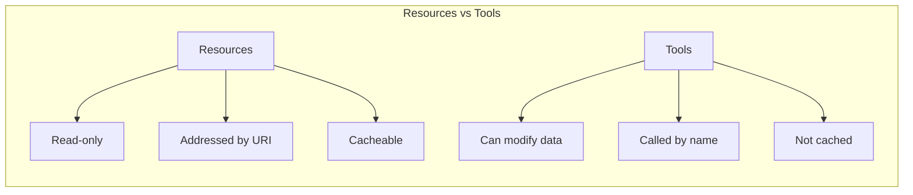

### Resource Types

**Static Resources** - Fixed URI, fixed content structure:

```typescript
server.registerResource(
  "about",                          // Name
  "mcp://my-app/about",             // Fixed URI
  { description: "About page" },    // Metadata
  async () => ({ contents: [...] }) // Handler
);
```

**Dynamic Resources (Templates)** - URI with parameters:

```typescript
server.registerResource(
  "user",
  new ResourceTemplate("mcp://my-app/users/{id}", { list: undefined }),
  { description: "User by ID" },
  async (uri, { id }) => ({ contents: [...] })
);
```

### Resource Registration Structure

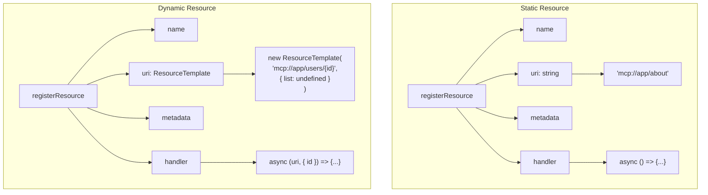

### Resource Response Format

```typescript
return {
  contents: [
    {
      uri: "mcp://my-app/about",  // URI of this content
      text: "Content here",       // The actual content
      mimeType: "text/plain",     // Optional: content type
    }
  ]
};
```

---

## Creating Pokemon Resources

Now let's create our Pokemon resources.

### Step 1: Create Pokemon Resources

Create `src/resources/pokemon.ts`:

```typescript
// ===================
// IMPORTS
// ===================

import {
  McpServer,
  ResourceTemplate,
} from "@modelcontextprotocol/sdk/server/mcp.js";
import { fetchPokemonList, fetchPokemonDetails } from "../utils/pokemon.js";

// Base URI for all our resources
const BASE_URI = "mcp://pokemon-battle";
```

**What's a URI?**

URI = Uniform Resource Identifier. It's like a URL but for any resource.

```
mcp://pokemon-battle/about
│     │              │
│     │              └── Path (specific resource)
│     └── Host (server name)
└── Scheme (protocol)
```

```typescript
// ===================
// RESOURCE REGISTRATION
// ===================

export function registerPokemonResources(server: McpServer) {
  // ===================
  // ABOUT RESOURCE (Static)
  // ===================

  server.registerResource(
    "about",                        // Resource name
    `${BASE_URI}/about`,            // Full URI
    {
      description: "Information about the Pokemon Battle MCP server",
      mimeType: "text/plain",       // Content type hint
    },
    async () => ({                  // Handler returns content
      contents: [
        {
          uri: `${BASE_URI}/about`,
          text: "Pokemon Battle MCP Server - Simulate epic Pokemon battles! Use the pokemon-battle tool to pit two Pokemon against each other and get detailed battle stats with AI-generated battle narratives.",
        },
      ],
    })
  );
```

**Static resource characteristics:**

- URI never changes
- Content is relatively fixed
- Good for: About pages, configuration, status

```typescript
  // ===================
  // POKEMON LIST RESOURCE (Static, but fetches dynamic data)
  // ===================

  server.registerResource(
    "pokemon-list",
    `${BASE_URI}/pokemon`,
    {
      description: "List of Pokemon from PokeAPI",
      mimeType: "application/json",  // We're returning JSON
    },
    async () => {
      // Fetch from PokeAPI each time
      const pokemonList = await fetchPokemonList(50);

      return {
        contents: [
          {
            uri: `${BASE_URI}/pokemon`,
            // Convert to formatted JSON string
            text: JSON.stringify(pokemonList, null, 2),
          },
        ],
      };
    }
  );
```

**Why JSON.stringify?**

Resource content must be a string. We convert the array to a JSON string.

```typescript
  // ===================
  // POKEMON DETAILS RESOURCE (Dynamic)
  // ===================

  server.registerResource(
    "pokemon-details",

    // ResourceTemplate creates a dynamic URI pattern
    new ResourceTemplate(`${BASE_URI}/pokemon/{name}`, {
      list: undefined,  // No automatic listing of all possible values
    }),

    {
      description: "Get detailed information about a Pokemon by name",
      mimeType: "application/json",
    },

    // Handler receives URI and extracted variables
    async (uri, { name }) => {
      // Handle both string and array (template quirk)
      const pokemonName = Array.isArray(name) ? name[0] : name;

      // Fetch Pokemon details
      const pokemon = await fetchPokemonDetails(pokemonName);

      // Handle not found
      if (!pokemon) {
        return {
          contents: [
            {
              uri: uri.href,  // Use the actual requested URI
              text: JSON.stringify(
                { error: `Pokemon "${pokemonName}" not found` },
                null,
                2
              ),
            },
          ],
        };
      }

      // Return Pokemon data
      return {
        contents: [
          {
            uri: uri.href,
            text: JSON.stringify(pokemon, null, 2),
          },
        ],
      };
    }
  );
}
```

**ResourceTemplate explained:**

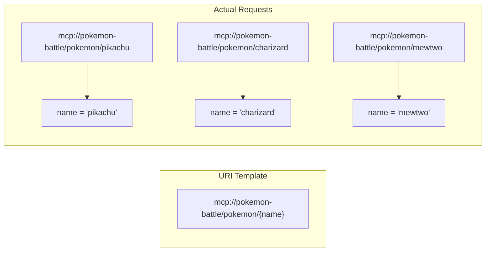

**Why `Array.isArray(name) ? name[0] : name`?**

ResourceTemplate can return either a string or array for template variables. This handles both cases.

---

## Wiring Everything Together

Now let's create the entry point that brings everything together.

### Step 1: Create the Entry Point

Create `src/index.ts`:

```typescript
// ===================
// IMPORTS
// ===================

import { McpServer } from "@modelcontextprotocol/sdk/server/mcp.js";
import { createMcpHttpServer } from "./http.js";
import { registerPokemonBattleTool } from "./tools/pokemon-battle.js";
import { registerPokemonResources } from "./resources/pokemon.js";
```

**Note the `.js` extensions:**

Even though we write `.ts` files, we import with `.js` because:
1. TypeScript compiles to JavaScript
2. Node.js ES modules require extensions
3. The compiled code will look for `.js` files

```typescript
// ===================
// SERVER FACTORY
// ===================

/**
 * Factory function that creates a new MCP server instance
 * Called for each new session
 */
const createServer = () => {
  // Create the MCP server with configuration
  const server = new McpServer(
    // Server identification
    {
      version: "1.0.0",
      name: "pokemon-battle-mcp",
    },
    // Server options
    {
      // Instructions help AI understand how to use this server
      instructions:
        "This server provides Pokemon data and battle simulations. Use the pokemon-battle tool to simulate battles between Pokemon and create exciting battle narratives.",

      // Declare capabilities
      capabilities: {
        logging: {},    // We can send log messages
        tools: {},      // We have tools
        resources: {},  // We have resources
      },
    }
  );

  // Register our tool
  registerPokemonBattleTool(server);

  // Register our resources
  registerPokemonResources(server);

  // Return configured server
  return server;
};
```

**Why a factory function?**

Each session gets a fresh server instance. This:
1. Isolates sessions from each other
2. Prevents state leakage
3. Allows per-session customization

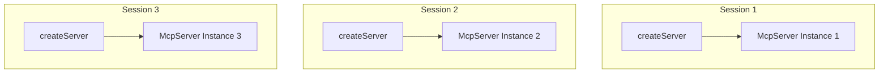

```typescript
// ===================
// START SERVER
// ===================

// Create HTTP server wrapper
const mcp = createMcpHttpServer({
  createServer,  // Pass our factory function
  port: 3001,    // Listen on port 3001
});

// Start listening for connections
mcp.start();

// ===================
// GRACEFUL SHUTDOWN
// ===================

// Handle Ctrl+C
process.on("SIGINT", () => {
  mcp.stop().then(() => process.exit(0));
});
```

**What's SIGINT?**

SIGINT = Signal Interrupt. Sent when you press Ctrl+C. We catch it to:
1. Close all active sessions properly
2. Stop the HTTP server
3. Exit cleanly

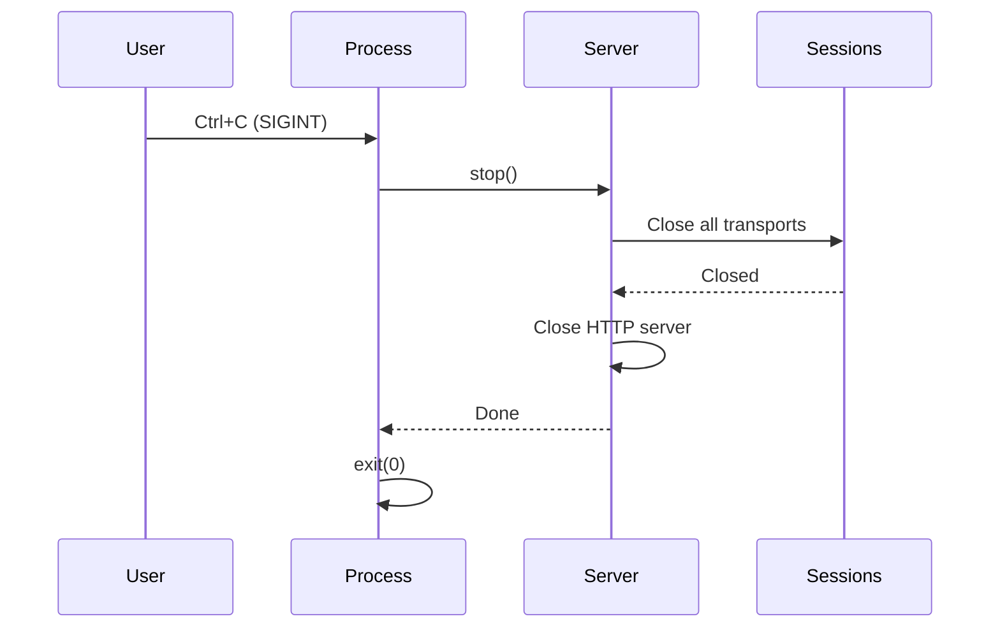

### Step 2: Verify Project Structure

Your project should now look like:

```
pokemon-battle-mcp/
├── package.json
├── tsconfig.json
├── .gitignore
└── src/
    ├── index.ts           # Entry point - wires everything together
    ├── http.ts            # HTTP transport - handles connections
    ├── utils/
    │   └── pokemon.ts     # API helpers - fetches Pokemon data
    ├── tools/
    │   └── pokemon-battle.ts  # Battle tool - simulates fights
    └── resources/
        └── pokemon.ts     # Resources - provides Pokemon data
```

### Step 3: Build the Project

```bash
npm run build
```

**What happens:**
1. TypeScript compiler (`tsc`) runs
2. Reads `tsconfig.json` for settings
3. Compiles all `.ts` files in `src/`
4. Outputs `.js` files to `dist/`

You should see no errors.

### Step 4: Start the Server

```bash
npm start
```

You should see:

```
MCP server listening on http://localhost:3001/mcp
```

**Your server is now running!**

---

## Testing with MCP Inspector

The MCP Inspector is a web-based tool for testing MCP servers.

### Step 1: Run Development Mode

```bash
npm run dev
```

This starts both the server and the inspector using `concurrently`.

### Step 2: Connect in Inspector

1. Open the inspector URL shown in terminal (usually `http://localhost:5173`)
2. Select **"Streamable HTTP"** as transport type
3. Enter URL: `http://localhost:3001/mcp`
4. Click **Connect**

```mermaid
graph LR
    A[Inspector UI] -->|HTTP| B[Your MCP Server]
    B -->|Response| A
```

### Step 3: Test Resources

1. Go to the **Resources** tab
2. You should see your registered resources
3. Click on `pokemon-list` - see list of Pokemon
4. Try `pokemon-details` - enter a name like `pikachu`

### Step 4: Test the Battle Tool

1. Go to the **Tools** tab
2. Select `pokemon-battle`
3. Enter:
   - `pokemon1`: `pikachu`
   - `pokemon2`: `charizard`
4. Click **Run**

You should see battle results with stats and a narrative prompt!

### Step 5: Test Error Handling

Try the battle tool with:
- `pokemon1`: `fakemon`
- `pokemon2`: `notreal`

You should see a helpful error message.

---

## Connecting to Claude Desktop

### Step 1: Locate Config File

The Claude Desktop config is at:

- **macOS**: `~/Library/Application Support/Claude/claude_desktop_config.json`
- **Windows**: `%APPDATA%\Claude\claude_desktop_config.json`

### Step 2: Edit Configuration

Open the config file and add your server:

```json
{
  "mcpServers": {
    "pokemon-battle": {
      "command": "npx",
      "args": [
        "mcp-remote",
        "http://localhost:3001/mcp"
      ]
    }
  }
}
```

**What's mcp-remote?**

Claude Desktop typically uses stdio transport. `mcp-remote` is a bridge that:
1. Claude spawns it as a stdio process
2. It connects to your HTTP server
3. Translates between stdio and HTTP

### Step 3: Start Your Server

In a terminal:

```bash
cd pokemon-battle-mcp
npm start
```

**Keep this terminal open** while using Claude Desktop.

### Step 4: Restart Claude Desktop

Quit and reopen Claude Desktop to load the new configuration.

### Step 5: Test in Claude

Try these prompts:

- "List all available Pokemon"
- "Tell me about Pikachu's stats"
- "Battle Pikachu vs Charizard"
- "Who would win: Mewtwo or Dragonite?"

Claude will use your MCP server to fetch data and simulate battles!

---

## Summary

Congratulations! You've built a complete MCP server. Here's what you learned:

### MCP Architecture

```mermaid
mindmap
  root((MCP Server))
    Server Instance
      McpServer class
      Name and version
      Capabilities
      Instructions
    Transport
      stdio
        Local only
        Single client
      HTTP
        Network accessible
        Multiple clients
    Tools
      Actions AI can execute
      Input validation with Zod
      Return content arrays
    Resources
      Data AI can read
      Static or dynamic URIs
      Read-only
```

### Key Concepts

| Concept | What It Is |
|---------|------------|
| MCP Server | Core object that handles protocol |
| Transport | How messages travel (HTTP/stdio) |
| Session | Stateful connection with a client |
| Tool | Action the AI can call |
| Resource | Data the AI can read |
| Capability | Feature declaration |

### Code Organization

| File | Purpose |
|------|---------|
| `index.ts` | Entry point, wires components |
| `http.ts` | HTTP transport layer |
| `utils/pokemon.ts` | API helpers and types |
| `tools/pokemon-battle.ts` | Battle tool |
| `resources/pokemon.ts` | Pokemon resources |

### Next Steps

Ideas to extend your server:

- **Add more tools**: Team builder, type effectiveness calculator
- **Add caching**: Store API responses to reduce calls
- **Add authentication**: Secure your server
- **Deploy**: Host on a cloud server
- **Add prompts**: Pre-defined prompt templates

Happy building! 🎮
